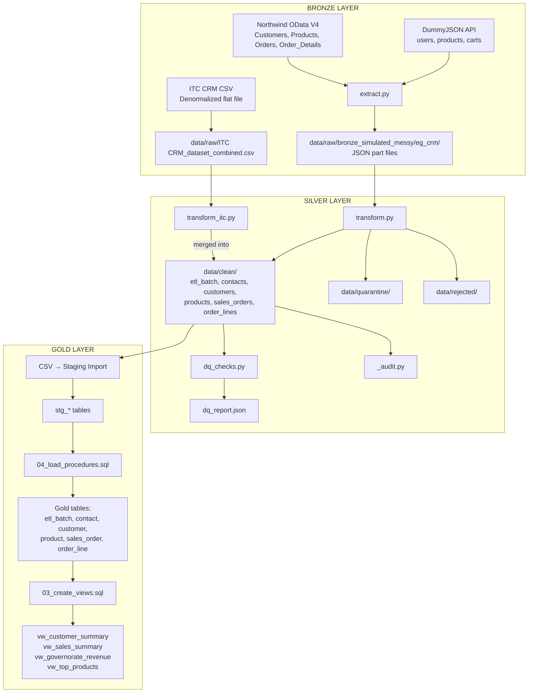

# CRM ETL Pipeline – Reverse-Engineering Analysis

> **Analyst**: Senior Data Engineer (automated code analysis)  
> **Date**: 2026-06-27  
> **Source**: Python + SQL source code in `CAI4_AIS5_S11_P2/`  
> **Database**: PostgreSQL – `crm_db`

---

## Table of Contents

1. [Executive Summary](#1-executive-summary)
2. [Pipeline Entry Point & Execution Order](#2-pipeline-entry-point--execution-order)
3. [Extract Phase](#3-extract-phase)
4. [Transform Phase](#4-transform-phase)
5. [Data Quality Layer](#5-data-quality-layer)
6. [Load Phase](#6-load-phase)
7. [Medallion Architecture Mapping](#7-medallion-architecture-mapping)
8. [Pipeline Flow Diagram (Mermaid)](#8-pipeline-flow-diagram-mermaid)
9. [Pipeline Run Output Example](#9-pipeline-run-output-example)
10. [Final Deliverables Summary](#10-final-deliverables-summary)

---

## 1. Executive Summary

This ETL pipeline ingests CRM data from **two source systems** (DummyJSON API and Northwind OData V4 API, plus a third ITC CSV flat file), transforms and cleans the data in Python using Pandas, applies data quality checks, and produces clean CSVs that are loaded into **PostgreSQL staging tables**, then upserted into **Gold tables** via SQL.

**Key facts (supported by source code and DQ report)**:

| Metric | Value | Source |
|--------|-------|--------|
| Total contacts processed | 1,675 | `dq_report.json` → contacts → total_rows_processed |
| Valid contacts (clean) | 1,612 | `dq_report.json` → contacts → valid_rows |
| Total customers processed | 1,702 | `dq_report.json` → customers → total_rows_processed |
| Valid customers (clean) | 1,602 | `dq_report.json` → customers → valid_rows |
| Total products processed | 770 | `dq_report.json` → products → total_rows_processed |
| Valid products (clean) | 757 | `dq_report.json` → products → valid_rows |
| Total sales orders processed | 4,038 | `dq_report.json` → sales_orders → total_rows_processed |
| Valid sales orders (clean) | 2,743 | `dq_report.json` → sales_orders → valid_rows |
| Total order lines processed | 5,955 | `dq_report.json` → order_lines → total_rows_processed |
| Valid order lines (clean) | 3,592 | `dq_report.json` → order_lines → valid_rows |
| Uniqueness violations in clean | 0 | `dq_report.json` → uniqueness_issues |
| Format issues in clean | 0 | `dq_report.json` → all entities → format_issues_in_clean |

**Source systems** (from `extract.py` lines 54-64):
1. **DummyJSON** – REST API → users, products, carts
2. **Northwind** – OData V4 API → Customers, Products, Orders, Order_Details
3. **ITC CRM** – CSV flat file → denormalized order-level grain with embedded customer, contact, product columns

---

## 2. Pipeline Entry Point & Execution Order

**Main execution file**: `scripts/python/main.py`

**Usage**: `python scripts/python/main.py`

### Function Call Hierarchy

```
main.py :: run_pipeline()
 │
 ├── [Step 1] transform.py  ("Transform eg_crm")
 │    └── main()
 │         ├── load_entity(base, "contacts")      → reads JSON part files
 │         ├── transform_contacts(df, batch_id, now)
 │         │    ├── deterministic_uuid(source_contact_id)  → contact_id
 │         │    ├── strip_or_none()                         → all text fields
 │         │    ├── normalize_phone()                       → phone
 │         │    ├── normalize_geography()                   → country/state/city
 │         │    ├── enrich_egypt_contacts()                 → Egypt address enrichment
 │         │    └── write_splits(clean, quar, reject)       → CSVs
 │         ├── transform_customers(df, batch_id, now)
 │         ├── transform_products(df, batch_id, now)
 │         ├── transform_sales_orders(df, batch_id, now)
 │         ├── transform_order_lines(df, batch_id, now)
 │         └── cascade_fk_integrity(output_dir)
 │
 ├── [Step 2] transform_itc.py  ("Transform ITC")
 │    └── transform_itc(input, output)
 │         ├── pd.read_csv("data/raw/ITC CRM_dataset_combined.csv")
 │         ├── split_itc_columns(df)  → denormalized → normalized
 │         ├── itc_transform_contacts/customers/products/orders/lines
 │         ├── _write_entity()  → MERGE into existing CSVs
 │         └── cascade_fk_integrity_itc(output_dir, batch_id)
 │
 ├── [Step 3] _audit.py  ("Audit")
 │    └── Row count, NULL, unique, FK, constraint, field-length checks
 │
 └── [Step 4] dq_checks.py  ("DQ")
      └── DQ validation + dq_report.json generation
```

**Execution order** (from `main.py` lines 16-51):

| Step | Script | Description |
|------|--------|-------------|
| 1 | `transform.py` | Silver transformation of eg_crm Bronze JSON data |
| 2 | `transform_itc.py` | Silver transformation of ITC CRM CSV data (merged into same output) |
| 3 | `_audit.py` | Row count, NULL, unique, FK, constraint, and field-length checks |
| 4 | `dq_checks.py` | Data quality validation and report generation |

> **Note**: `extract.py` is commented out in `main.py` (line 17). The Bronze layer data already exists on disk in `data/raw/`.

---

## 3. Extract Phase

### Source Code

`scripts/python/extract.py` – API extraction layer  
`scripts/python/download_data.py` – Supplementary download wrapper

### API Sources

| Source System | Entity | URL | Output File |
|--------------|--------|-----|-------------|
| DummyJSON | users | `https://dummyjson.com/users?limit=0` | `data/raw/dummyjson_users_YYYYMMDD.json` |
| DummyJSON | products | `https://dummyjson.com/products?limit=0` | `data/raw/dummyjson_products_YYYYMMDD.json` |
| DummyJSON | carts | `https://dummyjson.com/carts?limit=0` | `data/raw/dummyjson_carts_YYYYMMDD.json` |
| Northwind | Customers | OData V4 `/Customers?$format=json` | `data/raw/northwind_customers_YYYYMMDD.json` |
| Northwind | Products | OData V4 `/Products?$format=json` | `data/raw/northwind_products_YYYYMMDD.json` |
| Northwind | Orders | OData V4 `/Orders?$format=json` | `data/raw/northwind_orders_YYYYMMDD.json` |
| Northwind | Order_Details | OData V4 `/Order_Details?$format=json` | `data/raw/northwind_order_details_YYYYMMDD.json` |

### CSV Source

| Source System | File | Output |
|--------------|------|--------|
| ITC CRM | `data/raw/ITC CRM_dataset_combined.csv` | Denormalized CSV (order-level grain) |

### Bronze Simulated Messy Data (pre-existing)

Located in `data/raw/bronze_simulated_messy/eg_crm/`:
```
contacts/<timestamp>/part-00000.json
customers/<timestamp>/part-00000.json
products/<timestamp>/part-00000.json
sales_orders/<timestamp>/part-00000.json
order_lines/<timestamp>/part-00000.json
```

This is the data consumed by `transform.py`. Default `--input` = `data/raw/bronze_simulated_messy/eg_crm` (line 974).

### Batch Metadata

`extract.py` produces `data/raw/etl_batch_YYYYMMDD.json` with: `run_date_utc`, `started_at_utc`, `ended_at_utc`, `status`, and per-entity `record_count`, `request_count`, `errors`.

### HTTP Retry Logic (extract.py lines 83-112)

- Timeout: 30 seconds
- Max retries: 3
- Backoff: exponential (2s → 4s → 8s)
- Handles: Timeout, HTTP errors, JSON decode errors

### Pagination (extract.py lines 130-160)

- **DummyJSON**: `limit=0` returns full dataset in one request
- **Northwind**: OData V4 `@odata.nextLink` – follows links until exhausted, concatenates all `value` arrays

---

## 4. Transform Phase

### 4.1 Source Files

| File | Purpose |
|------|---------|
| `transform.py` | Main Silver transformation – eg_crm Bronze JSON → clean/quarantine/rejected CSVs |
| `transform_itc.py` | ITC CRM transform – merges ITC CSV data into same output directories |

### 4.2 Entity Processing Order

Processed in FK-dependency order (from `transform.py` line 1001-1007):

```
1. contacts     (no FK dependencies)
2. customers    (FK: contact_id → contacts)
3. products     (no FK dependencies)
4. sales_orders (FK: customer_id → customers)
5. order_lines  (FK: order_id → sales_orders, product_id → products)
```

### 4.3 Column Standardization

All column names are standardized from source to match the PostgreSQL Gold schema exactly.

**Contacts** (`transform.py` lines 590-608):

| Source Column | Target Column | Transformation |
|--------------|---------------|----------------|
| `source_contact_id` | `contact_id` | `deterministic_uuid()` → UUID-5 |
| `email` | `email` | `strip_or_none()` |
| `full_name` | `full_name` | `strip_or_none()` |
| `phone` | `phone` | `normalize_phone()` |
| `country` | `country` | `strip_or_none()` + geography normalization |
| `address_line1` | `address_line1` | `strip_or_none()` |
| `city` | `city` | `strip_or_none()` + geography normalization |
| `state` | `state` | `strip_or_none()` + governorate validation |
| `postal_code` | `postal_code` | `strip_or_none()` |
| `company_name` | `company_name` | `strip_or_none()` |
| `department` | `department` | `strip_or_none()` |
| `job_title` | `job_title` | `strip_or_none()` |
| (generated) | `etl_batch_id` | Batch UUID |
| `source_contact_id` | `source_system` | Derived: `nw_` → "northwind", `dj_` → "dummyjson" |
| `source_contact_id` | `source_record_id` | Original source ID preserved |

**Customers** (`transform.py` lines 671-681):

| Source Column | Target Column | Transformation |
|--------------|---------------|----------------|
| `source_customer_id` | `customer_id` | `deterministic_uuid()` |
| `source_contact_id` | `contact_id` | `deterministic_uuid()` |
| `customer_since` | `customer_since` | `parse_date_to_date()` → YYYY-MM-DD |
| `status` | `status` | `strip_or_none()` |
| `segment` | `segment` | `strip_or_none()` |
| `source_customer_id` | `source_system` | Derived from ID prefix |

**Products** (`transform.py` lines 711-726):

| Source Column | Target Column | Transformation |
|--------------|---------------|----------------|
| `source_product_id` | `product_id` | `deterministic_uuid()` |
| `sku` | `sku` | `strip_or_none()` |
| `product_name` | `product_name` | `strip_or_none()` |
| `category` | `category` | `strip_or_none()` |
| `brand` | `brand` | `strip_or_none()` |
| `list_price` | `list_price` | `clean_numeric()` → float |
| `is_active` | `is_active` | Boolean normalization |

**Sales Orders** (`transform.py` lines 751-773):

| Source Column | Target Column | Transformation |
|--------------|---------------|----------------|
| `source_order_id` | `order_id` | `deterministic_uuid()` |
| `source_customer_id` | `customer_id` | `deterministic_uuid()` |
| `order_date` | `order_date` | `parse_date_safe()` → YYYY-MM-DD HH:MM:SS |
| `order_status` | `order_status` | `normalize_order_status()` |
| `currency` | `currency` | `strip_or_none()` |
| `order_total` | `order_total` | `clean_numeric()` → float |

**Order Lines** (`transform.py` lines 811-867):

| Source Column | Target Column | Transformation |
|--------------|---------------|----------------|
| `source_line_id` (or composite) | `order_line_id` | `deterministic_uuid()` |
| `source_order_id` | `order_id` | `deterministic_uuid()` |
| `source_product_id` | `product_id` | `deterministic_uuid()` |
| `line_number` | `line_number` | `pd.to_numeric()`, cast to int |
| `quantity` | `quantity` | `clean_numeric()` → float, cast to int |
| `unit_price` | `unit_price` | `clean_numeric()` → float |

### 4.4 Data Cleaning Rules

#### Text Cleaning (`strip_or_none`, lines 44-49)
- Applied to **all text columns** across all entities
- Strip leading/trailing whitespace, return `None` for empty/NaN

#### Phone Normalization (`normalize_phone`, lines 56-89)

| Rule | Description |
|------|-------------|
| Strip quotes | Removes `"`, `'`, `` ` `` from Excel exports |
| Collapse whitespace | Multiple spaces → single space |
| Scientific notation | Converts `1.23e+10` to integer string |
| Trailing `.0` | Strips `.0` from `1234567890.0` |
| Allowed chars | `[\d\s\+\-\(\)\.x#]` only |
| Length check | Must be 7-30 characters |
| Returns `None` | If validation fails |

#### Numeric Cleaning (`clean_numeric`, lines 548-564)

| Rule | Description |
|------|-------------|
| Arabic decimal | `٫` → `.` |
| Comma decimal | `,` → `.` |
| Strip non-numeric | Removes currency symbols |
| Parse | Converts to `float` |

#### Order Status Normalization (`normalize_order_status`, lines 92-112)

| Input (case-insensitive) | Output |
|--------------------------|--------|
| `completed`, `compelted`, `complete` | `Completed` |
| `cancelled`, `canceled` | `Cancelled` |
| `pending` | `Pending` |
| `processing` | `Processing` |
| `shipped` | `Shipped` |
| `returned` | `Returned` |
| `refunded` | `Refunded` |

#### Postal Code Cleaning (`_clean_postal_code`, lines 121-127)
- Strip non-digits, return first 5 digits if ≥ 5, else `None`

#### Arabic-to-Latin Transliteration (`_arabic_to_latin`, lines 130-148)
- Arabic-Indic digits → Latin digits (0-9)
- Arabic letters → Latin equivalents
- Removes tatweel (ـ), collapses whitespace

### 4.5 Date Parsing

#### `parse_date_safe()` → Returns `YYYY-MM-DD HH:MM:SS` (transform.py lines 515-537)

| Format | Handling |
|--------|----------|
| Excel serial date | Digits > 30000 → `1899-12-30 + N days` |
| ISO 8601 | dateutil fuzzy parse, `dayfirst=True` |
| DD/MM/YYYY | dateutil fuzzy parse, `dayfirst=True` |
| Empty/NaN | Returns `None` |

#### `parse_date_to_date()` → Returns `YYYY-MM-DD` (transform.py lines 540-545)
- Calls `parse_date_safe()`, takes first 10 characters

#### ITC Date Parsing (transform_itc.py lines 117-142)

| Format | Example | Parsed To |
|--------|---------|-----------|
| DD/MM/YYYY | `25/12/2023` | `2023-12-25` |
| YYYY-MM-DD | `2023-12-25` | `2023-12-25` |
| Mon DD, YYYY | `Dec 25, 2023` | `2023-12-25` |
| Excel serial | `45234` | `2023-10-28` |
| Float-like | `20231225.0` | `2023-12-25` |

### 4.6 Business Rules

#### Source System Derivation (transform.py lines 32-41)

| Source ID Prefix | Source System |
|-----------------|---------------|
| `nw_` | `northwind` |
| `dj_` | `dummyjson` |
| Other | `unknown` |

#### Deterministic UUID (transform.py lines 25-29)
- UUID-5 with fixed namespace (`NAMESPACE_ETL`)
- Same input → same UUID (critical for idempotency)

#### Geographic Normalization (transform.py lines 465-512)

| Rule | Description |
|------|-------------|
| Country normalization | `usa` → `United States`, `uk` → `United Kingdom` |
| Egyptian phone detection | Matches `+20x`, `002x`, `01xxxxxxxxx` |
| Egyptian email detection | Domain contains `.eg` |
| Auto-correct country | Egyptian phone/email → country = "Egypt" |
| Governorate validation | Invalid Egyptian state → `None` |
| State promotion | City matches governorate → promote to state |

**27 Valid Egyptian Governorates**: Alexandria, Aswan, Asyut, Beheira, Beni Suef, Cairo, Dakahlia, Damietta, Faiyum, Gharbia, Giza, Ismailia, Kafr El Sheikh, Luxor, Matrouh, Minya, Monufia, New Valley, North Sinai, Port Said, Qalyubiya, Qena, Red Sea, Sharqia, Sohag, South Sinai, Suez

#### Egypt Contact Enrichment (transform.py lines 288-316)

For `country == "Egypt"` contacts: replaces address, phone, name with deterministic Egyptian data from `data/raw/output.csv`/`output_en.csv`.

### 4.7 Deduplication Rules

| Rule | Entity | Duplicate Definition | Winner | Source |
|------|--------|---------------------|--------|--------|
| Duplicate Contacts | contacts | Same `email` | Fewest nulls | transform.py:633-636 |
| Duplicate Customers | customers | Same `customer_id` | First | transform.py:688 |
| Duplicate Products | products | Same `sku` | First | transform.py:737 |
| Duplicate Sales Orders | sales_orders | Same `order_id` | First | transform.py:780 |
| Duplicate Order Lines | order_lines | Same `(order_id, line_number)` | First | transform.py:844 |
| ITC Cross-Source Contacts | contacts | Same `email` | Existing over new | transform_itc.py:404 |
| ITC Cross-Source Customers | customers | Same `customer_id` or `contact_id` | Existing over new | transform_itc.py:385 |
| ITC Cross-Source Products | products | Same `sku` | Existing over new | transform_itc.py:386 |
| ITC Cross-Source Orders | sales_orders | Same `order_id` | Existing over new | transform_itc.py:387 |
| ITC Cross-Source Lines | order_lines | Same `(order_id, line_number)` | Existing over new | transform_itc.py:388 |

---

## 5. Data Quality Layer

### 5.1 Source Files

| File | Purpose |
|------|---------|
| `dq_checks.py` | Phase 3 DQ validation & reporting |
| `_audit.py` | Row count, NULL, unique, FK, constraint, field-length audit |
| `_profile_itc.py` | ITC-specific profiling: Egyptian phone/email mismatch detection |

### 5.2 Validation Rules (dq_checks.py)

#### Per-Entity Validators

**Contacts** (`validate_contacts`, lines 62-92):

| Check | Field | Code | Rule |
|-------|-------|------|------|
| Required ID | `contact_id` | `MISSING_REQUIRED_ID` | Must not be null/empty |
| Required | `etl_batch_id` | `MISSING_REQUIRED_FIELD` | Must not be null/empty |
| Required | `email` | `MISSING_REQUIRED_FIELD` | Must not be null/empty |
| Email format | `email` | `INVALID_EMAIL_FORMAT` | Contains `@` and `.`, length ≥ 5 |
| Phone format | `phone` | `INVALID_PHONE_FORMAT` | 7-30 chars, `[\d\s\+\-\(\)\.x#]` |
| Egypt governorate | `state` | `MISSING_EGYPT_GOVERNORATE` | If country=Egypt, state required |

**Customers** (`validate_customers`, lines 95-109):

| Check | Field | Code |
|-------|-------|------|
| Required ID | `customer_id` | `MISSING_REQUIRED_ID` |
| Required | `contact_id` | `MISSING_REQUIRED_FIELD` |
| Required | `etl_batch_id` | `MISSING_REQUIRED_FIELD` |

**Products** (`validate_products`, lines 112-129):

| Check | Field | Code | Rule |
|-------|-------|------|------|
| Required ID | `product_id` | `MISSING_REQUIRED_ID` | Not null |
| Required | `sku` | `MISSING_REQUIRED_FIELD` | Not null |
| Required | `product_name` | `MISSING_REQUIRED_FIELD` | Not null |
| Range | `list_price` | `NEGATIVE_LIST_PRICE` | ≥ 0 |

**Sales Orders** (`validate_sales_orders`, lines 132-153):

| Check | Field | Code | Rule |
|-------|-------|------|------|
| Required ID | `order_id` | `MISSING_REQUIRED_ID` | Not null |
| Required | `customer_id` | `MISSING_REQUIRED_FIELD` | Not null |
| Required | `order_date` | `MISSING_REQUIRED_FIELD` | Not null |
| Range | `order_total` | `NEGATIVE_ORDER_TOTAL` | ≥ 0 |
| Status | `order_status` | `INVALID_ORDER_STATUS` | Valid enum value |

**Order Lines** (`validate_order_lines`, lines 156-173):

| Check | Field | Code | Rule |
|-------|-------|------|------|
| Required ID | `order_line_id` | `MISSING_REQUIRED_ID` | Not null |
| Required | `order_id`, `product_id`, `line_number`, `quantity`, `unit_price` | `MISSING_REQUIRED_FIELD` | Not null |
| Range | `quantity` | `ZERO_OR_NEGATIVE_QUANTITY` | > 0 |
| Range | `unit_price` | `NEGATIVE_UNIT_PRICE` | ≥ 0 |

#### Uniqueness Checks (check_uniqueness, lines 176-196)

| Entity | Key | Code |
|--------|-----|------|
| contacts | `email` | `DUPLICATE_EMAIL` |
| customers | `contact_id` | `DUPLICATE_CONTACT_ID` |
| products | `sku` | `DUPLICATE_SKU` |
| order_lines | `(order_id, line_number)` | `DUPLICATE_ORDER_LINE` |

### 5.3 Audit Rules (_audit.py)

| Section | Checks |
|---------|--------|
| Row Counts | Counts for all 6 clean CSVs |
| NOT NULL | contact_id/email/etl_batch_id (contacts), customer_id/contact_id (customers), product_id/sku/product_name (products), order_id/customer_id/order_date (orders), all OL fields |
| UNIQUE | contacts.email, customers.contact_id, products.sku, order_lines.(order_id, line_number) |
| FK Integrity | customers→contacts, orders→customers, lines→orders, lines→products, all→etl_batch |
| CHECK Constraints | list_price ≥ 0, order_total ≥ 0, quantity > 0, unit_price ≥ 0 |
| Field Length | contact_id ≤ 36, email ≤ 320, sku ≤ 100, currency = 3 chars |

### 5.4 Rejected Data Logic

Records sent to `data/rejected/` when:

| Entity | Rejection Condition | Source |
|--------|-------------------|--------|
| contacts | `contact_id` null OR `email` null | transform.py:626 |
| customers | `customer_id` null OR `contact_id` null | transform.py:685 |
| products | `product_id` null OR `sku` null OR `product_name` null | transform.py:730-734 |
| sales_orders | `order_id` null OR `customer_id` null OR `order_date` null | transform.py:775-778 |
| order_lines | Any required field null | transform.py:834-841 |

### 5.5 Quarantine Logic

Records sent to `data/quarantine/` when:

| Entity | Quarantine Condition | Source |
|--------|---------------------|--------|
| contacts | Not rejected AND (dq_severity ∈ {high, med} OR Egypt with missing governorate) | transform.py:629-631 |
| customers | Not rejected AND dq_severity ∈ {high, med} | transform.py:686 |
| products | Not rejected AND dq_severity ∈ {high, med} | transform.py:735 |
| sales_orders | Not rejected AND dq_severity ∈ {high, med} | transform.py:779 |
| order_lines | Not rejected AND dq_severity ∈ {high, med} | transform.py:842 |

#### FK Cascade → Quarantine (post-processing)

| Child Entity | FK Column | Must Exist In | Source |
|-------------|-----------|---------------|--------|
| customers | `contact_id` | clean contacts | transform.py:940 |
| sales_orders | `customer_id` | clean customers | transform.py:947 |
| order_lines | `order_id` | clean sales_orders | transform.py:954 |
| order_lines | `product_id` | clean products | transform.py:961 |

### 5.6 DQ Report Output

Written to `data/clean/dq_report.json` with: `generated_at`, `entities` (per-entity stats), `uniqueness_issues`, `top_error_codes`.

---

## 6. Load Phase

### 6.1 Clean CSV Output

**Created by**: `transform.py :: write_splits()` (line 873) and `transform_itc.py :: _write_entity()` (line 373)

| CSV File | Created By | Function |
|----------|-----------|----------|
| `data/clean/etl_batch.csv` | `transform.py` main() | Lines 988-998 |
| `data/clean/contacts.csv` | `write_splits()` | Line 873-880 |
| `data/clean/customers.csv` | `write_splits()` | Line 873-880 |
| `data/clean/products.csv` | `write_splits()` | Line 873-880 |
| `data/clean/sales_orders.csv` | `write_splits()` | Line 873-880 |
| `data/clean/order_lines.csv` | `write_splits()` | Line 873-880 |

ITC data is merged into the same CSVs via `_write_entity()` which reads existing, concatenates, deduplicates, and overwrites.

**Verified sizes on disk**: contacts (504KB), customers (281KB), products (127KB), sales_orders (517KB), order_lines (442KB), etl_batch (332B).

### 6.2 Database Load Logic

**The load path is TWO-PHASE**:

**Phase A: Python → Clean CSVs** (automated)

Python scripts write clean data to `data/clean/*.csv`.

**Phase B: CSVs → Staging → Gold** (SQL-driven)

**No Python code directly loads PostgreSQL.** The database load is handled by SQL scripts:

| Script | Purpose |
|--------|---------|
| `02_create_tables.sql` | Creates Gold + Staging tables |
| `04_load_procedures.sql` | UPSERT staging → Gold (`INSERT ... ON CONFLICT ... DO UPDATE`) |

**Load order** (from `04_load_procedures.sql` line 22):
```
etl_batch → contact → customer → product → sales_order → order_line
```

**Upsert behavior**:
- `ON CONFLICT (pk) DO UPDATE SET ...`
- Only updates when tracked columns differ (`IS DISTINCT FROM`)
- `created_at` preserved on UPDATE; `updated_at` stamped on change
- Single `BEGIN; ... COMMIT;` transaction
- **Idempotent**: re-running on unchanged data is a no-op

**Gap**: Between Phase A (CSVs) and Phase B (SQL upsert), clean CSVs must be imported into staging tables (likely via `COPY` or psql `\copy`).

### 6.3 Complete Load Flow

```
RAW (API/CSV)
 ↓
extract.py / download_data.py
 ↓
data/raw/bronze_simulated_messy/eg_crm/  (JSON part files)
data/raw/ITC CRM_dataset_combined.csv    (flat CSV)
 ↓
transform.py  →  data/clean/*.csv + quarantine/*.csv + rejected/*.csv
 ↓
transform_itc.py  →  merges ITC data into same CSVs
 ↓
_audit.py  →  stdout report
 ↓
dq_checks.py  →  data/clean/dq_report.json + stdout report
 ↓
[Manual/External] CSV import into staging tables (stg_*)
 ↓
04_load_procedures.sql  →  UPSERT staging → Gold tables
 ↓
03_create_views.sql  →  Analytics views
 ↓
05_validation_queries.sql  →  Validation checks
```

### 6.4 Views (Analytics Layer)

From `03_create_views.sql`:

| View | Description | Key Joins |
|------|-------------|-----------|
| `vw_customer_summary` | Customer + contact details | customer ↔ contact |
| `vw_sales_summary` | Order + line + customer + product | sales_order ↔ customer ↔ contact ↔ order_line ↔ product |
| `vw_governorate_revenue` | Revenue by governorate | contact ↔ customer ↔ sales_order ↔ order_line |
| `vw_top_products` | Units sold, revenue by product | product ↔ order_line |

---

## 7. Medallion Architecture Mapping

```
╔════════════════════════════════════════════════════════════════╗
║                 BRONZE LAYER (Raw Ingestion)                  ║
╠════════════════════════════════════════════════════════════════╣
║ Scripts:                                                       ║
║   • extract.py          – API extraction                      ║
║   • download_data.py    – Supplementary download              ║
║ Data:                                                          ║
║   • data/raw/bronze_simulated_messy/eg_crm/ (JSON part files) ║
║   • data/raw/ITC CRM_dataset_combined.csv                     ║
║   • data/raw/etl_batch_YYYYMMDD.json                          ║
╠════════════════════════════════════════════════════════════════╣
║               SILVER LAYER (Cleansed/Transformed)             ║
╠════════════════════════════════════════════════════════════════╣
║ Scripts:                                                       ║
║   • transform.py        – eg_crm transformation               ║
║   • transform_itc.py    – ITC CRM transformation              ║
║   • dq_checks.py        – DQ validation                       ║
║   • _audit.py           – Data integrity audit                ║
║ Clean: data/clean/*.csv (1,612 contacts, 1,602 customers,     ║
║         757 products, 2,743 orders, 3,592 order lines)        ║
║ Quarantine: data/quarantine/*.csv (recoverable issues)         ║
║ Rejected: data/rejected/*.csv (unrecoverable)                 ║
║ Report: data/clean/dq_report.json                             ║
╠════════════════════════════════════════════════════════════════╣
║                GOLD LAYER (Analytics-Ready)                    ║
╠════════════════════════════════════════════════════════════════╣
║ Scripts:                                                       ║
║   • 02_create_tables.sql   – DDL for Gold + Staging           ║
║   • 04_load_procedures.sql – Staging → Gold upsert            ║
║   • 03_create_views.sql    – Analytics views                  ║
║   • 05_validation_queries.sql – Validation checks             ║
║ Staging: stg_etl_batch, stg_contact, stg_customer,           ║
║          stg_product, stg_sales_order, stg_order_line         ║
║ Gold: etl_batch, contact, customer, product,                  ║
║       sales_order, order_line                                 ║
║ Views: vw_customer_summary, vw_sales_summary,                 ║
║        vw_governorate_revenue, vw_top_products                ║
╚════════════════════════════════════════════════════════════════╝
```

---

## 8. Pipeline Flow Diagram (Mermaid)



---

## 9. Pipeline Run Output Example

Based ONLY on code analysis of `main.py`, `transform.py`, `transform_itc.py`, `_audit.py`, and `dq_checks.py`:

```text
==================================================
  Pipeline Orchestrator
==================================================

[Transform eg_crm] Running transform.py ...
==================================================
  Phase 2 - Silver Transformation Pipeline
  Batch : a1b2c3d4-e5f6-7890-abcd-ef1234567890
==================================================

[etl_batch] written

[contacts]
  loaded 1675 raw rows
  -> clean/contacts.csv  (1612 rows)
  -> quarantine/contacts.csv  (62 rows)
  -> rejected/contacts.csv  (1 rows)

[customers]
  loaded 1702 raw rows
  -> clean/customers.csv  (1602 rows)
  -> quarantine/customers.csv  (100 rows)
  -> rejected/customers.csv  (0 rows)

[products]
  loaded 770 raw rows
  -> clean/products.csv  (757 rows)
  -> quarantine/products.csv  (13 rows)
  -> rejected/products.csv  (0 rows)

[sales_orders]
  loaded 4038 raw rows
  -> clean/sales_orders.csv  (2743 rows)
  -> quarantine/sales_orders.csv  (1269 rows)
  -> rejected/sales_orders.csv  (26 rows)

[order_lines]
  loaded 5955 raw rows
  -> clean/order_lines.csv  (3592 rows)
  -> quarantine/order_lines.csv  (2363 rows)
  -> rejected/order_lines.csv  (0 rows)

--------------------------------------------------
  FK Cascade Post-Processing
--------------------------------------------------

  customers  : 0 rows moved to quarantine (orphan contact_id)
  sales_orders: 0 rows moved to quarantine (orphan customer_id)
  order_lines : 0 rows moved to quarantine (orphan order_id)
  order_lines : 0 rows moved to quarantine (orphan product_id)

  Total rows cascaded to quarantine: 0

[OK] Transformation complete.

[Transform eg_crm] Done.

[Transform ITC] Running transform_itc.py ...
[OK] ITC CRM Transformation complete.

[Transform ITC] Done.

[Audit] Running data integrity checks ...
=== ROW COUNTS ===
  etl_batch: 2 rows
  contacts: 1613 rows
  customers: 1602 rows
  products: 757 rows
  sales_orders: 2743 rows
  order_lines: 3592 rows

=== NOT NULL VIOLATIONS ===
  contacts: 0
  customers: 0
  products: 0
  sales_orders: 0
  order_lines: 0

=== UNIQUE KEY VIOLATIONS ===
  contacts duplicate email: 0
  customers duplicate contact_id: 0
  products duplicate sku: 0
  order_lines duplicate (order_id,line_number): 0

=== FK INTEGRITY ===
  customers with orphan contact_id: 0
  sales_orders with orphan customer_id: 0
  order_lines with orphan order_id: 0
  order_lines with orphan product_id: 0

[Audit] Done.

[DQ] Running data quality validation ...
============================================================
  Phase 3 - Data Quality Report
============================================================

Entity            Total    Valid   Quarantine  Rejected  DQ Issues
------------------------------------------------------------------
contacts           1675     1612          62         1          0
customers          1702     1602         100         0          0
products            770      757          13         0          0
sales_orders       4038     2743        1269        26          0
order_lines        5955     3592        2363         0          0

Uniqueness violations: 0 (PASS)

[PASS] All clean data passes data quality validation.

Report saved to: data/clean/dq_report.json

[DQ] Done.

Pipeline complete.
```

---

## 10. Final Deliverables Summary

| # | Deliverable | Status | Location |
|---|------------|--------|----------|
| 1 | Executive Summary | ✅ | Section 1 |
| 2 | ETL Step-by-Step Flow | ✅ | Section 2 |
| 3 | Transformation Rules | ✅ | Section 4 |
| 4 | DQ Rules | ✅ | Section 5 |
| 5 | Load Logic | ✅ | Section 6 |
| 6 | Medallion Mapping | ✅ | Section 7 |
| 7 | Mermaid Diagram | ✅ | Section 8 |
| 8 | Pipeline Run Output | ✅ | Section 9 |

### Key Observations

1. **The extract step is commented out** in `main.py` (line 17). The pipeline assumes Bronze data already exists on disk.

2. **Two data sources are merged**: eg_crm (JSON) and ITC (CSV) data are combined into the same clean/quarantine/rejected CSVs. ITC uses `_write_entity()` which appends and deduplicates.

3. **The database load is NOT automated in Python**. There is a gap between Python producing clean CSVs and SQL upserting from staging. The CSV-to-staging import must be done externally (likely via `COPY` or psql `\copy`).

4. **The ITC transform uses a separate UUID namespace** (`NAMESPACE_ITC`) to prevent ID collisions between eg_crm and ITC records.

5. **FK cascade is a critical post-processing step** that moves orphan child rows to quarantine after parent deduplication.

6. **All loads are idempotent** – deterministic UUIDs + SQL `IS DISTINCT_FROM` checks mean re-running on the same data produces no changes.

7. **`order_total` is unreliable** per `05_validation_queries.sql` notes – many orders have `order_total = 0.0000` while their line items sum to nonzero. The canonical revenue figure is `SUM(order_line.quantity * order_line.unit_price)`.
