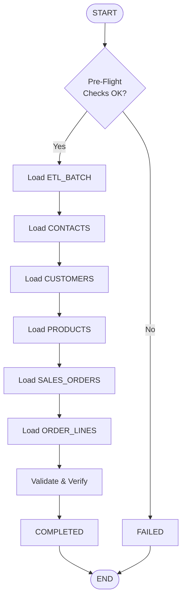

```mermaid
flowchart TD
    Start([START]) --> Check{Pre-Flight<br/>Checks OK?}
    Check -->|No| Failed[FAILED]
    Check -->|Yes| ETL_BATCH[Load ETL_BATCH]
    ETL_BATCH --> Contacts[Load CONTACTS]
    Contacts --> Customers[Load CUSTOMERS]
    Customers --> Products[Load PRODUCTS]
    Products --> Sales[Load SALES_ORDERS]
    Sales --> Lines[Load ORDER_LINES]
    Lines --> Validate[Validate & Verify]
    Validate --> Success[COMPLETED]
    Success --> End([END])
    Failed --> End
```
