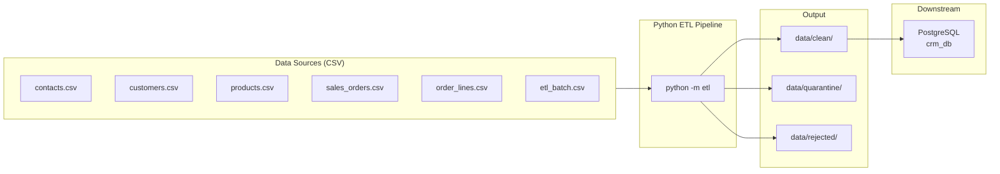

# CRM Customer Data ETL Pipeline

> Consolidates fragmented customer records from a CRM system into a single clean, analysis-ready PostgreSQL database — eliminating duplicates, inconsistent formats, and data gaps.

[](https://github.com/ItcProjects-R4/CAI4_AIS5_S11_P2/stargazers)
[](https://github.com/ItcProjects-R4/CAI4_AIS5_S11_P2/network)
[](https://github.com/ItcProjects-R4/CAI4_AIS5_S11_P2/issues)
[](https://github.com/ItcProjects-R4/CAI4_AIS5_S11_P2/commits)
[](https://github.com/ItcProjects-R4/CAI4_AIS5_S11_P2)

---

## Pipeline Workflow



**Architecture pattern:** Medallion — `Bronze (raw/)` → `Silver (local transform)` → `Gold (clean/ + PostgreSQL)`

---

## What the Pipeline Does

| Step | Action |
|---|---|---|
| **Extract** | Reads all six CSV files from `data/raw/` |
| **Transform** | Cleans, normalises, and validates each table independently |
| **Validate** | Checks PK uniqueness, required fields, FK integrity, email/SKU uniqueness |
| **Load** | Truncates staging tables, bulk-loads clean CSVs, upserts into PostgreSQL gold tables |
| **Reconcile** | Verifies no rows were lost and DB counts match staging |

### Business Rules Applied

- `email` → lowercased and trimmed
- `full_name` → title-cased and trimmed
- `phone` → digits/dashes only
- `department` → canonicalised via lookup table
- `country` → title-cased
- `segment` → canonicalised (`b2b`, `b2c`, `corporate`, `retail`)
- `order_status` → canonicalised (`pending`, `completed`, `cancelled`, `shipped`)
- `currency` → validated (`USD`, `EGP`)

---

## Data Sources

The pipeline reads six CSV files from `data/raw/`, each representing one entity:

| File | Contents |
|------|----------|
| `contacts.csv` | Contact records with email, name, phone, address, company |
| `customers.csv` | Customer accounts with segment, status, customer_since |
| `products.csv` | Product catalog with SKU, category, brand, price |
| `sales_orders.csv` | Order headers with dates, status, currency, totals |
| `order_lines.csv` | Line items with quantity, unit price per product |
| `etl_batch.csv` | Pipeline run metadata |

All files share a consistent header row and UTF-8 encoding.

→ Full schema: [`wiki/Data-Sources.md`](wiki/Data-Sources.md)

---

## Tech Stack

| Tool | Role |
|---|---|
| **PostgreSQL** | Target database (`crm_db`) |
| **Python** | ETL pipeline — extract, transform, validate, load, reconcile |
| **CSV** | Source data format |
| **Git / GitHub** | Version control, PR templates, issue templates |

---

## SQL Schema

The target database is `crm_db`. Scripts live in [`scripts/sql/scripts/`](scripts/sql/scripts/) and must be run in order on first setup.

| Script | Purpose |
|---|---|
| [`01_enterprise_data_model_mysql.sql`](scripts/sql/scripts/01_enterprise_data_model_mysql.sql) | Enterprise data model reference |
| [`02_create_tables.sql`](scripts/sql/scripts/02_create_tables.sql) | Create gold + staging tables |
| [`03_create_views.sql`](scripts/sql/scripts/03_create_views.sql) | Summary views |
| [`04_load_procedures.sql`](scripts/sql/scripts/04_load_procedures.sql) | Staging → gold upsert logic |
| [`05_validation_queries.sql`](scripts/sql/scripts/05_validation_queries.sql) | Post-run quality checks |

**Key tables:**
- `customer` — final clean records (PK: `customer_id`)
- `stg_*` — staging tables, cleared after each run
- `etl_batch` — audit log of every pipeline run (rows loaded, status, timestamps)

→ Full schema: [`wiki/SQL-Schema.md`](wiki/SQL-Schema.md)

---

## Project Structure

```
CAI4_AIS5_S11_P2/
├── data/
│   ├── raw/              ← Source CSV files (never edit)
│   ├── clean/            ← Pipeline writes processed output here
│   ├── rejected/         ← Rows that failed validation
│   └── quarantine/       ← Recoverable but suspicious rows
├── etl/                  ← Python ETL pipeline
│   ├── main.py           ← Orchestrator
│   ├── extract.py        ← Reads data/raw/
│   ├── transform.py      ← Cleans and normalises
│   ├── validate.py       ← Quality checks
│   ├── load.py           ← Loads to PostgreSQL
│   ├── reconcile.py      ← Verifies row counts
│   ├── config.py         ← Configuration
│   ├── utils/            ← DB and logging utilities
│   └── logs/             ← Per-run log files
├── scripts/sql/scripts/  ← Numbered SQL scripts
├── wiki/                 ← Full documentation
├── presentation/         ← Demo slides and screenshots
└── .github/              ← Issue templates, PR template, CI/CD
```

---

## How to Run

→ Full step-by-step guide: [`wiki/Run-Guide.md`](wiki/Run-Guide.md)

---

## Data Quality Handling

| Layer | Contents | Rule |
|---|---|---|
| `data/raw/` | Original, unmodified source files | Never edit — source of truth |
| `data/clean/` | Validated, schema-compliant records ready for SQL load | Written by pipeline after each run |
| `data/rejected/` | Unrecoverable rows (missing primary keys, unparseable dates) | Permanently excluded from load |
| `data/quarantine/` | Recoverable rows held for review (FK orphans, DQ flags) | Available for manual correction |

> **Rejected vs Quarantine:** See [Data Quality Definitions](wiki/Data-Quality-Definitions.md) for full definitions of each data tier.

**Post-run validation checklist** (from [`05_validation_queries.sql`](scripts/sql/scripts/05_validation_queries.sql)):
- Row count is non-zero and within expected range
- No NULL primary keys or required fields
- No duplicate primary key values
- All `segment` values are valid (`b2b`, `b2c`, `corporate`, `retail`)
- All FK references are valid
- All non-null dates fall between `2000-01-01` and today

→ Full validation guide: [`wiki/Data-Validation.md`](wiki/Data-Validation.md)

---

## Orchestration

- **Local ETL pipeline** — run with `python -m etl` or `python -m etl --skip-db` for CSV-only
- **Triggers:** Manual run from the command line
- **Monitoring:** Console/log output during each run; audit history in `etl_batch` table

→ Orchestration details: [`wiki/Run-Guide.md`](wiki/Run-Guide.md)

---

## Wiki — Full Documentation

| Page | What you will find |
|---|---|
| [Home](wiki/Home.md) | Project overview and wiki navigation |
| [Project Flow](wiki/project_flow.md) | Team planning flow, roles, and timeline |
| [Project Architecture](wiki/Project-Architecture.md) | Medallion layers, full architecture diagram, data flow |
| [ETL Pipeline](wiki/ETL-Pipeline.md) | ETL pipeline end-to-end, transform steps, running instructions |
| [Transformation Rules](wiki/Transformation-Rules.md) | Null handling, type conversions, dedup logic, FK cascade rules |
| [Data Sources](wiki/Data-Sources.md) | CRM and Excel schemas, known quality issues, file checklist |
| [SQL Schema](wiki/SQL-Schema.md) | Table definitions, views, functions, ad-hoc queries |
| [Data Quality Definitions](wiki/Data-Quality-Definitions.md) | Rejected vs Quarantine vs Clean — what each means and when |
| [Data Validation](wiki/Data-Validation.md) | Post-run validation queries and failure investigation guide |
| [Setup Guide](wiki/Setup-Guide.md) | Full environment setup from zero to first pipeline run |
| [Contributing](wiki/Contributing.md) | Branching, commits, pull requests, labels, code style |
| [Glossary](wiki/Glossary.md) | Plain-English definitions of every technical term |
| [Team Roles](wiki/Team-Roles.md) | Role ownership and responsibilities |

---

## Project Goals

- Consolidate customer records from CRM exports and Excel spreadsheets into a single trusted dataset
- Apply consistent business rules for emails, names, phone numbers, countries, and dates
- Detect and remove duplicate or incomplete customer records before they reach the database
- Load clean, query-ready data into PostgreSQL (`crm_db`) for downstream analytics
- Keep every pipeline run traceable through staging tables and the `etl_batch` audit log
- Document the pipeline clearly enough for a new teammate to run it independently

---

## Key Features

- Multi-source ingestion from CRM exports and Excel spreadsheets
- Automated cleaning: email/name normalization, phone formatting, date parsing
- Deduplication logic with a defined precedence rule between sources
- Rejected/quarantine handling for rows that fail validation
- PostgreSQL schema (`crm_db`) with staging tables and run-level audit logging
- Modular, numbered SQL scripts for repeatable environment setup
- Documented post-run validation checklist for data quality checks

---

## Team Members

| Name | Role |
|---|---|
| Ali | Project Lead, Architecture, ETL Coordination |
| Amin | Data Collection, Cloud Storage, ETL Support |
| Mennat Allah | Data Modeling, SQL Architecture, BI Direction |
| Aseel | Data Quality, Validation, Testing |
| Habiba | Documentation, BI Reporting, Quality Support |

---

## Challenges

- Reconciling inconsistent column names and formats between the CRM and Excel sources
- Deciding which record should win when CRM and Excel data conflict for the same customer
- Designing a staging and audit structure (`etl_batch`, `stg_*`) that keeps every run traceable
- Re-aligning the original SQL Server-style schema design to PostgreSQL conventions

---

## Future Improvements

- Add scheduled, recurring pipeline runs (e.g. via `cron`)
- Build out the Power BI / Excel reporting layer on top of `crm_db`
- Expand validation into a configurable, rule-based data quality engine
- Add a lightweight dashboard for monitoring `etl_batch` run history

---

## Screenshots

> _Placeholder — replace with actual screenshots before submission._

| View | Preview |
|---|---|
| Pipeline run output | `` |
| Clean data sample | `` |
| crm_db tables | `` |
| Validation results | `` |

---

## Demo Video

> _Placeholder — replace with the real video link before submission._

🎥 [Watch the project walkthrough](https://your-video-link-here.example.com)

---

## Contributing

1. Pick an open [issue](https://github.com/Ali-Hegazy-Ai/CAI4_AIS5_S11_P2/issues) and comment to claim it
2. Create a branch: `feature/your-task`, `fix/your-fix`, `docs/your-update`
3. Make focused changes (one PR = one thing)
4. Test your changes, then open a pull request using the [PR template](.github/PULL_REQUEST_TEMPLATE.md)
5. Get one approval before merging

New issues can be filed using the [task](.github/ISSUE_TEMPLATE/task.md), [bug report](.github/ISSUE_TEMPLATE/bug_report.md), or [feature request](.github/ISSUE_TEMPLATE/feature_request.md) templates.

→ Full guide: [`wiki/Contributing.md`](wiki/Contributing.md)
