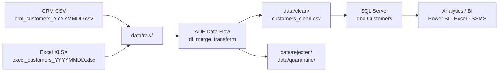

# CRM Customer Data ETL Pipeline

> Consolidates fragmented customer records from CRM exports and Excel spreadsheets into a single clean, analysis-ready SQL table — eliminating duplicates, inconsistent formats, and data gaps.

[](https://github.com/Ali-Hegazy-Ai/CAI4_AIS5_S11_P2/stargazers)
[](https://github.com/Ali-Hegazy-Ai/CAI4_AIS5_S11_P2/network)
[](https://github.com/Ali-Hegazy-Ai/CAI4_AIS5_S11_P2/issues)
[](https://github.com/Ali-Hegazy-Ai/CAI4_AIS5_S11_P2/commits)
[](https://github.com/Ali-Hegazy-Ai/CAI4_AIS5_S11_P2)

---

## Pipeline Workflow



**Architecture pattern:** Medallion — `Bronze (raw/)` → `Silver (ADF transform)` → `Gold (clean/ + SQL)`

---

## What the Pipeline Does

| Step | Action |
|---|---|
| **Extract** | Reads `crm_customers_*.csv` and `excel_customers_*.xlsx` from `data/raw/` |
| **Rename** | Unifies column names across both sources to a single schema |
| **Transform** | Lowercases emails, title-cases names, normalises phone numbers, parses dates |
| **Filter** | Drops rows with null `CustomerID` or blank `CustomerName` → `data/rejected/` |
| **Merge** | Unions CRM and Excel streams into one combined dataset |
| **Deduplicate** | Aggregates on `CustomerID` — CRM record is preferred when both sources overlap |
| **Load** | Writes clean CSV to `data/clean/` and upserts rows into `dbo.Customers` via MERGE |

### Business Rules Applied

- `Email` → lowercased and trimmed (`john@example.com`)
- `CustomerName` → title-cased and trimmed (`John Doe`)
- `Phone` → normalised to `+XX-XXX-XXXXXXX` format
- `SignupDate` → parsed to ISO `YYYY-MM-DD` (supports `DD/MM/YYYY` and Excel serial numbers)
- `Country` → mapped from ISO-3 codes to full English names (`EGY` → `Egypt`)
- `Segment` → uppercased (`PREMIUM` / `STANDARD` / `BASIC`)
- `SourceSystem` → added to track record origin (`CRM` or `Excel`)

---

## Data Sources

| Source | Format | File Pattern | Key Column Names |
|---|---|---|---|
| CRM Export | CSV (UTF-8) | `crm_customers_YYYYMMDD.csv` | `customer_id`, `full_name`, `email`, `phone`, `signup_date`, `country`, `segment` |
| Excel Spreadsheet | `.xlsx` (sheet: `Customers`) | `excel_customers_YYYYMMDD.xlsx` | `CustomerID`, `Name`, `EmailAddress`, `PhoneNumber`, `JoinDate`, `Country`, `CustomerSegment` |

Both sources are joined on `CustomerID`. Place files in `data/raw/` before each pipeline run — **never edit files in `data/raw/`**.

→ Full schema details: [`wiki/Data-Sources.md`](wiki/Data-Sources.md)

---

## Tech Stack

| Tool | Role |
|---|---|
| **Azure Data Factory** | Pipeline orchestration (`pl_customer_etl`) |
| **ADF Data Flow** | Visual transformations — merge, clean, deduplicate (`df_merge_transform`) |
| **Azure Blob Storage** | Hosts `data/raw/` and `data/clean/` |
| **SQL Server / Azure SQL** | Target database (`CustomerDW`) |
| **Apache Airflow** | Scheduling and workflow monitoring |
| **Excel / CSV** | Source data formats |
| **Git / GitHub** | Version control, PR templates, issue templates |

---

## SQL Schema

The target database is `CustomerDW`. Scripts live in [`sql/scripts/`](sql/scripts/) and must be run in order on first setup.

| Script | Purpose |
|---|---|
| [`01_create_database.sql`](sql/scripts/01_create_database.sql) | Create `CustomerDW` |
| [`02_create_tables.sql`](sql/scripts/02_create_tables.sql) | Create `dbo.Customers`, `dbo.CustomerStaging`, `dbo.ETLRunLog` |
| [`03_create_views.sql`](sql/scripts/03_create_views.sql) | Create `dbo.vw_CustomerSummary` |
| [`04_load_procedures.sql`](sql/scripts/04_load_procedures.sql) | Create `dbo.usp_UpsertCustomers` (MERGE logic) |
| [`05_validation_queries.sql`](sql/scripts/05_validation_queries.sql) | Post-run quality checks |

**Key tables:**
- `dbo.Customers` — final clean records (PK: `CustomerID`)
- `dbo.CustomerStaging` — temporary buffer, cleared after each run
- `dbo.ETLRunLog` — audit log of every pipeline run (rows loaded, status, timestamps)

→ Full schema: [`wiki/SQL-Schema.md`](wiki/SQL-Schema.md)

---

## Project Structure

```
CAI4_AIS5_S11_P2/
├── data/
│   ├── raw/              ← Drop source files here (never edit)
│   ├── clean/            ← Pipeline writes processed output here
│   ├── rejected/         ← Rows that failed validation (null key, blank name)
│   └── quarantine/       ← Problem files awaiting review
├── sql/
│   └── scripts/          ← Numbered SQL scripts: tables, views, procedures, validation
├── adf/
│   ├── pipelines/        ← pl_customer_etl.json, df_merge_transform.json
│   ├── datasets/         ← ds_crm_source.json, ds_excel_source.json, etc.
│   └── linked_services/  ← ls_blob_storage.json, ls_sql_server.json
├── docs/                 ← Project guide, architecture notes, phase tracking
├── wiki/                 ← Full documentation (see navigation below)
├── presentation/         ← Demo slides and screenshots
└── .github/              ← Issue templates, PR template, CI/CD workflows
```

---

## How to Run

**Prerequisites:** Git, Azure CLI, ADF Studio (browser), SSMS, Azure Subscription

```bash
# 1. Clone the repository
git clone https://github.com/Ali-Hegazy-Ai/CAI4_AIS5_S11_P2.git
cd CAI4_AIS5_S11_P2

# 2. Log in to Azure
az login

# 3. Place source files in data/raw/ (follow naming convention above)

# 4. Run SQL setup scripts in SSMS (first time only, in order: 01 → 04)

# 5. Import ADF JSON assets into ADF Studio (adf/pipelines/, adf/datasets/, adf/linked_services/)

# 6. In ADF Studio: open pl_customer_etl → Debug (test) or Trigger Now (full run)

# 7. After the run, verify output and run validation queries
#    SELECT COUNT(*) FROM dbo.Customers;
#    -- or open sql/scripts/05_validation_queries.sql in SSMS
```

→ Step-by-step setup: [`wiki/Setup-Guide.md`](wiki/Setup-Guide.md)

---

## Data Quality Handling

| Layer | Contents | Rule |
|---|---|---|
| `data/raw/` | Original, unmodified source files | Never edit — source of truth |
| `data/clean/` | Validated, transformed, analysis-ready records | Written by pipeline after each run |
| `data/rejected/` | Rows that failed validation (null `CustomerID`, blank name) | Saved with a `RejectionReason` column |
| `data/quarantine/` | Files or records with unresolved issues pending review | Held until manually reviewed |

**Post-run validation checklist** (from [`05_validation_queries.sql`](sql/scripts/05_validation_queries.sql)):
- Row count is non-zero and within expected range
- No NULL `CustomerID` or blank `CustomerName`
- No duplicate `CustomerID` values
- All `Segment` values are `PREMIUM`, `STANDARD`, or `BASIC`
- Both `CRM` and `Excel` records appear in `SourceSystem` column
- All non-null dates fall between `2000-01-01` and today

→ Full validation guide: [`wiki/Data-Validation.md`](wiki/Data-Validation.md)

---

## Orchestration

- **Azure Data Factory** — runs `pl_customer_etl`: Copy CRM → Copy Excel → Data Flow → Write CSV → Load SQL
- **Apache Airflow** — schedules pipeline runs and monitors task-level success/failure
- **Triggers:** Manual (`Trigger Now`), Schedule (weekly), or Storage Event (new file in `data/raw/`)
- **Monitoring:** ADF Studio → Monitor → Pipeline Runs; audit history in `dbo.ETLRunLog`

→ Orchestration details: [`wiki/ETL-Pipeline.md`](wiki/ETL-Pipeline.md)

---

## ADF Assets

All pipeline, dataset, and linked service definitions are stored as JSON — **never edit these by hand**. Always modify in ADF Studio, then export and commit the updated JSON.

| Asset | Location |
|---|---|
| Pipeline | [`adf/pipelines/pl_customer_etl.json`](adf/pipelines/) |
| Data Flow | [`adf/pipelines/df_merge_transform.json`](adf/pipelines/) |
| Datasets | [`adf/datasets/`](adf/datasets/) |
| Linked Services | [`adf/linked_services/`](adf/linked_services/) |

---

## Wiki — Full Documentation

| Page | What you will find |
|---|---|
| [Home](wiki/Home.md) | Project overview and wiki navigation |
| [Project Architecture](wiki/Project-Architecture.md) | Medallion layers, full architecture diagram, data flow |
| [ETL Pipeline](wiki/ETL-Pipeline.md) | ADF pipeline end-to-end, Data Flow steps, running instructions |
| [Data Sources](wiki/Data-Sources.md) | CRM and Excel schemas, known quality issues, file checklist |
| [SQL Schema](wiki/SQL-Schema.md) | Table definitions, views, stored procedures, ad-hoc queries |
| [Data Validation](wiki/Data-Validation.md) | Post-run validation queries and failure investigation guide |
| [Setup Guide](wiki/Setup-Guide.md) | Full environment setup from zero to first pipeline run |
| [Contributing](wiki/Contributing.md) | Branching, commits, pull requests, labels, code style |
| [Glossary](wiki/Glossary.md) | Plain-English definitions of every technical term |
| [Team Roles](wiki/Team-Roles.md) | Role ownership and responsibilities |

---

## Contributing

1. Pick an open [issue](https://github.com/Ali-Hegazy-Ai/CAI4_AIS5_S11_P2/issues) and comment to claim it
2. Create a branch: `feature/your-task`, `fix/your-fix`, `docs/your-update`
3. Make focused changes (one PR = one thing)
4. Test your changes, then open a pull request using the [PR template](.github/PULL_REQUEST_TEMPLATE.md)
5. Get one approval before merging

New issues can be filed using the [task](.github/ISSUE_TEMPLATE/task.md), [bug report](.github/ISSUE_TEMPLATE/bug_report.md), or [feature request](.github/ISSUE_TEMPLATE/feature_request.md) templates.

→ Full guide: [`wiki/Contributing.md`](wiki/Contributing.md)
