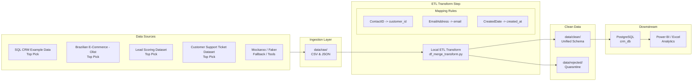

# CRM Customer Data ETL Pipeline

> Consolidates fragmented customer records from CRM exports and Excel spreadsheets into a single clean, analysis-ready SQL table — eliminating duplicates, inconsistent formats, and data gaps.

[](https://github.com/Ali-Hegazy-Ai/CAI4_AIS5_S11_P2/stargazers)
[](https://github.com/Ali-Hegazy-Ai/CAI4_AIS5_S11_P2/network)
[](https://github.com/Ali-Hegazy-Ai/CAI4_AIS5_S11_P2/issues)
[](https://github.com/Ali-Hegazy-Ai/CAI4_AIS5_S11_P2/commits)
[](https://github.com/Ali-Hegazy-Ai/CAI4_AIS5_S11_P2)

---

## Pipeline Workflow



**Architecture pattern:** Medallion — `Bronze (raw/)` → `Silver (local transform)` → `Gold (clean/ + PostgreSQL)`

---

## What the Pipeline Does

| Step | Action |
|---|---|
| **Extract** | Reads `crm_customers_*.csv` and `excel_customers_*.xlsx` from `data/raw/` |
| **Rename** | Unifies column names across both sources to a single schema |
| **Transform** | Lowercases emails, title-cases names, normalises phone numbers, parses dates |
| **Filter** | Drops rows with null `CustomerID` or blank `CustomerName` → `data/rejected/` |
| **Merge** | Unions CRM and Excel streams into one combined dataset |
| **Deduplicate** | Aggregates on `CustomerID` — CRM record is preferred when both sources overlap |
| **Load** | Writes clean CSV to `data/clean/` and upserts rows into `customer` via PostgreSQL `INSERT ... ON CONFLICT` |

### Business Rules Applied

- `Email` → lowercased and trimmed (`john@example.com`)
- `CustomerName` → title-cased and trimmed (`John Doe`)
- `Phone` → normalised to `+XX-XXX-XXXXXXX` format
- `SignupDate` → parsed to ISO `YYYY-MM-DD` (supports `DD/MM/YYYY` and Excel serial numbers)
- `Country` → mapped from ISO-3 codes to full English names (`EGY` → `Egypt`)
- `Segment` → uppercased (`PREMIUM` / `STANDARD` / `BASIC`)
- `SourceSystem` → added to track record origin (`CRM` or `Excel`)

---

## Data Sources

Source data lives under `eg_crm/`, organized by entity, with each extraction run written to its own dated folder:

| Entity | Path | Key Columns |
|---|---|---|
| Contacts | `eg_crm/contacts/<run_date>/` | `email`, `full_name`, `phone`, `country`, `address_line1`, `city`, `state`, `postal_code`, `company_name`, `department`, `job_title` |
| Customers | `eg_crm/customers/<run_date>/` | `customer_since`, `status`, `segment` |
| Products | `eg_crm/products/<run_date>/` | `sku`, `product_name`, `category`, `brand`, `list_price` |
| Sales Orders | `eg_crm/sales_orders/<run_date>/` | `order_date`, `order_status`, `currency`, `order_total` |
| Order Lines | `eg_crm/order_lines/<run_date>/` | `line_number`, `quantity`, `unit_price` |

A combined export of the same data is also available as `ITC_CRM_dataset_combined.csv`. Each run also writes a corresponding `manifests/<run_date>/` and `run_log/<run_date>/` entry for tracking. Place files under `eg_crm/` before each pipeline run — **never edit files in this folder directly**.

→ Full schema details: [`wiki/Data-Sources.md`](wiki/Data-Sources.md)

---

## Tech Stack

| Tool | Role |
|---|---|
| **PostgreSQL** | Target database (`crm_db`) |
| **Python** | ETL scripts — extract, transform, merge, load |
| **Excel / CSV** | Source data formats |
| **Git / GitHub** | Version control, PR templates, issue templates |

---

## SQL Schema

The target database is `crm_db`. Scripts live in [`sql/scripts/`](sql/scripts/) and must be run in order on first setup.

| Script | Purpose |
|---|---|
| [`01_create_database.sql`](sql/scripts/01_create_database.sql) | Create `crm_db` |
| [`02_create_tables.sql`](sql/scripts/02_create_tables.sql) | Create `customer`, `contact`, `product`, `sales_order`, `order_line`, `etl_batch`, and the `stg_*` staging tables |
| [`03_create_views.sql`](sql/scripts/03_create_views.sql) | Create summary views |
| [`04_load_procedures.sql`](sql/scripts/04_load_procedures.sql) | Create PostgreSQL upsert logic (`INSERT ... ON CONFLICT`) |
| [`05_validation_queries.sql`](sql/scripts/05_validation_queries.sql) | Post-run quality checks |

**Key tables:**
- `customer` — final clean records (PK: `customer_id`)
- `stg_*` — staging tables, cleared after each run
- `etl_batch` — audit log of every pipeline run (rows loaded, status, timestamps)

→ Full schema: [`wiki/SQL-Schema.md`](wiki/SQL-Schema.md)

---

## Project Structure

```
CAI4_AIS5_S11_P2/
├── data/
│   ├── raw/              ← Drop source files here (never edit)
│   ├── clean/            ← Pipeline writes processed output here
│   ├── rejected/         ← Rows that failed validation (null key, blank name)
│   └── quarantine/       ← Problem files awaiting review
├── sql/
│   └── scripts/          ← Numbered SQL scripts: tables, views, procedures, validation
├── docs/                 ← Optional supporting notes/assets (see docs/README.md)
├── wiki/                 ← Full documentation (see navigation below)
├── presentation/         ← Demo slides and screenshots
└── .github/              ← Issue templates, PR template, CI/CD workflows
```

---

## How to Run

**Prerequisites:** Git, PostgreSQL, `psql` (or pgAdmin), Python

```bash
# 1. Clone the repository
git clone https://github.com/Ali-Hegazy-Ai/CAI4_AIS5_S11_P2.git
cd CAI4_AIS5_S11_P2

# 2. Place source files in data/raw/ (follow naming convention above)

# 3. Run the SQL setup scripts against PostgreSQL (first time only, in order: 01 → 04)
psql -U postgres -f sql/scripts/01_create_database.sql
psql -U postgres -d crm_db -f sql/scripts/02_create_tables.sql
psql -U postgres -d crm_db -f sql/scripts/03_create_views.sql
psql -U postgres -d crm_db -f sql/scripts/04_load_procedures.sql

# 4. Run the ETL pipeline (extract, transform, merge, load into crm_db)

# 5. After the run, verify output and run validation queries
#    SELECT COUNT(*) FROM customer;
#    -- or run sql/scripts/05_validation_queries.sql against crm_db
```

→ Step-by-step setup: [`wiki/Setup-Guide.md`](wiki/Setup-Guide.md)

---

## Data Quality Handling

| Layer | Contents | Rule |
|---|---|---|
| `data/raw/` | Original, unmodified source files | Never edit — source of truth |
| `data/clean/` | Validated, schema-compliant records ready for SQL load | Written by pipeline after each run |
| `data/rejected/` | Unrecoverable rows (missing primary keys, unparseable dates) | Permanently excluded from load |
| `data/quarantine/` | Recoverable rows held for review (FK orphans, DQ flags) | Available for manual correction |

> **Rejected vs Quarantine:** See [Data Quality Definitions](wiki/Data-Quality-Definitions.md) for full definitions of each data tier.

**Post-run validation checklist** (from [`05_validation_queries.sql`](sql/scripts/05_validation_queries.sql)):
- Row count is non-zero and within expected range
- No NULL `CustomerID` or blank `CustomerName`
- No duplicate `CustomerID` values
- All `Segment` values are `PREMIUM`, `STANDARD`, or `BASIC`
- Both `CRM` and `Excel` records appear in `SourceSystem` column
- All non-null dates fall between `2000-01-01` and today

→ Full validation guide: [`wiki/Data-Validation.md`](wiki/Data-Validation.md)

---

## Orchestration

- **Local ETL scripts** — run the pipeline: Extract CRM → Extract Excel → Transform/Merge → Write CSV → Load into PostgreSQL
- **Triggers:** Manual run from the command line, or scheduled with `cron` for repeated runs
- **Monitoring:** Console/log output during each run; audit history in `etl_batch`

→ Orchestration details: [`wiki/ETL-Pipeline.md`](wiki/ETL-Pipeline.md)

---

## Wiki — Full Documentation

| Page | What you will find |
|---|---|
| [Home](wiki/Home.md) | Project overview and wiki navigation |
| [Project Flow](wiki/project_flow.md) | Team planning flow, roles, and timeline |
| [Project Architecture](wiki/Project-Architecture.md) | Medallion layers, full architecture diagram, data flow |
| [ETL Pipeline](wiki/ETL-Pipeline.md) | ETL pipeline end-to-end, transform steps, running instructions |
| [Transformation Rules](wiki/Transformation-Rules.md) | Null handling, type conversions, dedup logic, FK cascade rules |
| [Data Sources](wiki/Data-Sources.md) | CRM and Excel schemas, known quality issues, file checklist |
| [SQL Schema](wiki/SQL-Schema.md) | Table definitions, views, functions, ad-hoc queries |
| [Data Quality Definitions](wiki/Data-Quality-Definitions.md) | Rejected vs Quarantine vs Clean — what each means and when |
| [Data Validation](wiki/Data-Validation.md) | Post-run validation queries and failure investigation guide |
| [Setup Guide](wiki/Setup-Guide.md) | Full environment setup from zero to first pipeline run |
| [Contributing](wiki/Contributing.md) | Branching, commits, pull requests, labels, code style |
| [Glossary](wiki/Glossary.md) | Plain-English definitions of every technical term |
| [Team Roles](wiki/Team-Roles.md) | Role ownership and responsibilities |

---

## Contributing

1. Pick an open [issue](https://github.com/Ali-Hegazy-Ai/CAI4_AIS5_S11_P2/issues) and comment to claim it
2. Create a branch: `feature/your-task`, `fix/your-fix`, `docs/your-update`
3. Make focused changes (one PR = one thing)
4. Test your changes, then open a pull request using the [PR template](.github/PULL_REQUEST_TEMPLATE.md)
5. Get one approval before merging

New issues can be filed using the [task](.github/ISSUE_TEMPLATE/task.md), [bug report](.github/ISSUE_TEMPLATE/bug_report.md), or [feature request](.github/ISSUE_TEMPLATE/feature_request.md) templates.

→ Full guide: [`wiki/Contributing.md`](wiki/Contributing.md)
