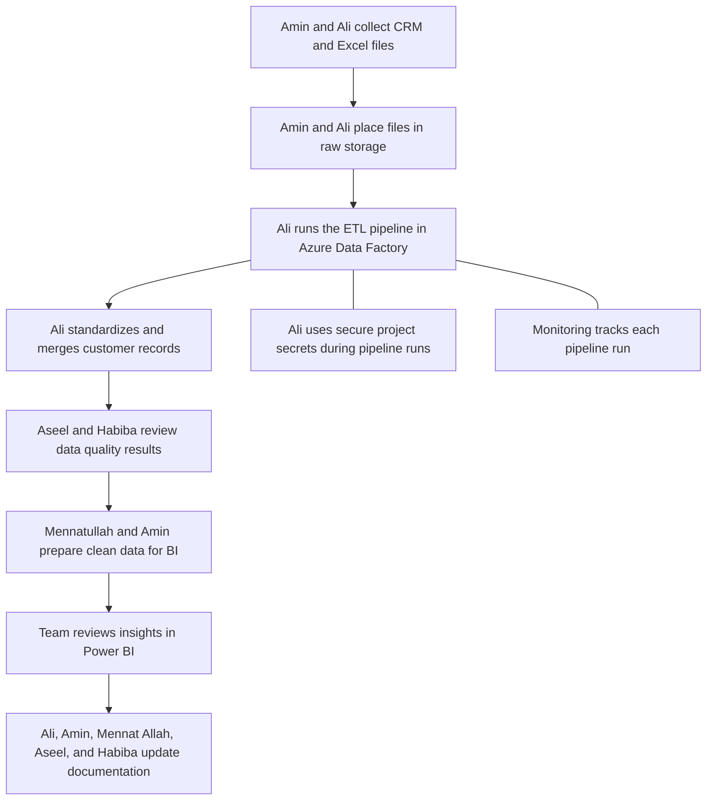
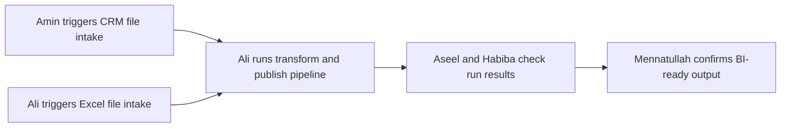
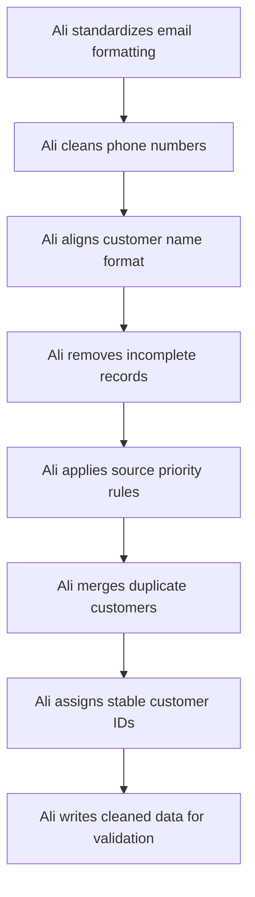
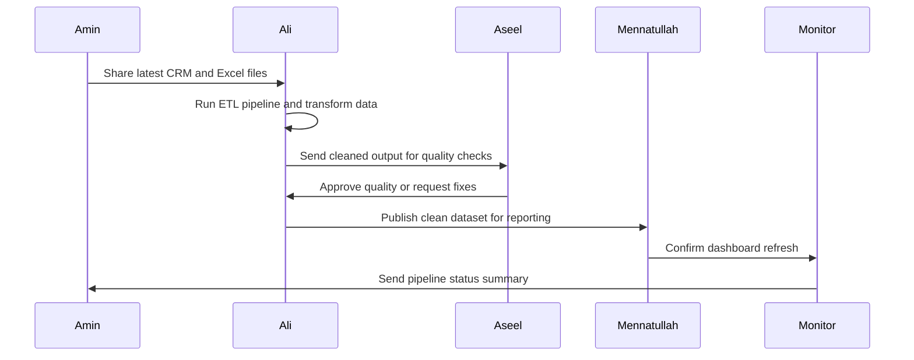
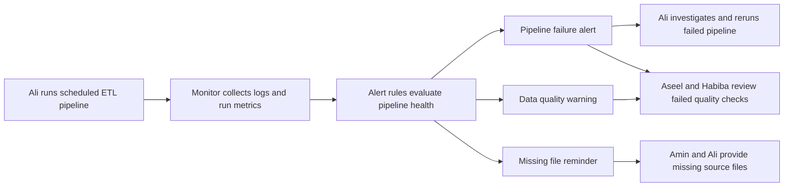
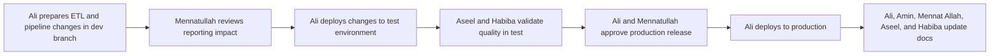
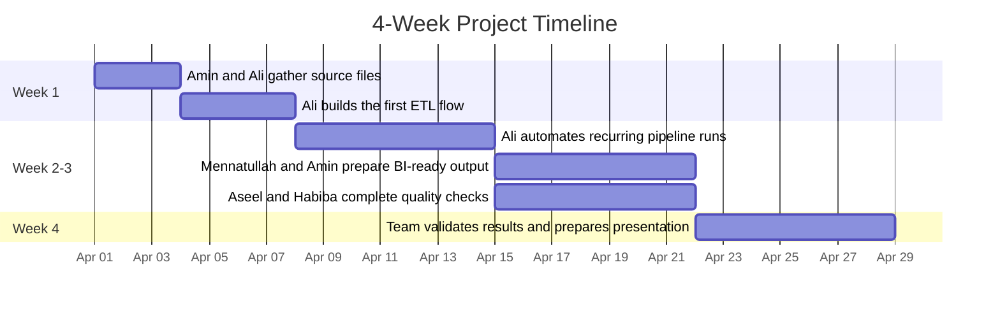

# ETL Planning Diagrams

This guide explains how the team works together from raw files to final reporting outputs.

## 1. High-Level Architecture

This diagram shows the full project story, including who performs each major step and how work moves from collection to reporting.

## 2. Role-Linked Pipeline Flow

This diagram shows who starts each pipeline activity and how ownership passes from ingestion to validated output.

## 3. Mapping Data Flow Steps

This diagram explains Ali's day-to-day transformation work in simple action steps.

## 4. Pipeline Sequence

This sequence shows team collaboration during one pipeline run from file handoff to monitoring updates.

## 5. Monitoring and Alerting

This diagram shows how alerts are routed to the right people and who responds first for each issue type.

## 6. CI/CD and Deployment Flow

This diagram explains how Ali and Mennatullah coordinate releases from development to production with team validation.

## 7. Project Timeline (4 Weeks)

This timeline shows when each team member is most active and how work transitions across the four weeks.

Owners by phase:
- Week 1: Amin and Ali lead source preparation and initial pipeline setup.
- Week 2-3: Ali leads automation, while Mennatullah, Amin, Aseel, and Habiba validate output quality and reporting readiness.
- Week 4: The full team finalizes validation, documentation, and presentation.

## 8. Deliverables Checklist

This diagram maps each deliverable to the team members responsible for producing or reviewing it.

```mermaid
flowchart TD
    D1["docs/project_flow.md\nAli, Amin, Mennat Allah, Aseel, Habiba"]
    D2["docs/architecture.md\nAli, Amin, Mennat Allah, Aseel, Habiba"]
    D3["adf/pipelines/pl_transform_merge_publish.json\nAli"]
    D4["sql/scripts/customer_schema.sql\nMennatullah, Amin"]
    D5["data/raw/sample_crm.csv\nAmin, Ali"]
    D6["data/raw/sample_excel.xlsx\nAmin, Ali"]
    D7["data/clean/customers.csv\nAli"]
    D8["presentation/final.pdf\nAli, Amin, Mennat Allah, Aseel, Habiba"]

    Amin["Amin"] -.-> D1
    Amin -.-> D2
    Amin -.-> D4
    Amin -.-> D5
    Amin -.-> D6
    Amin -.-> D8

    Ali["Ali"] -.-> D1
    Ali -.-> D2
    Ali -.-> D3
    Ali -.-> D5
    Ali -.-> D6
    Ali -.-> D7
    Ali -.-> D8

    Mennatullah["Mennatullah"] -.-> D4
    Mennatullah -.-> D8

    Aseel["Aseel"] -.-> D1
    Aseel -.-> D2
    Aseel -.-> D8

    Habiba["Habiba"] -.-> D1
    Habiba -.-> D2
    Habiba -.-> D8
```

## 9. Enterprise Data Platform and AI Architecture

This diagram presents a polished, portfolio-ready left-to-right enterprise architecture for an end-to-end data and AI platform.

```mermaid
flowchart LR
    %% Layer groups in exact required order
    subgraph L1[Ingestion]
      direction TB
      I1["Connectors\nKafka • CDC • Batch Upload"]
      I2["Orchestration\nADF / Airflow Schedules"]
    end

    subgraph L2[Raw Landing]
      direction TB
      R1["Immutable Storage\nBronze Zone / Object Store"]
      R2["Metadata Capture\nSource • Arrival Time • Schema"]
    end

    subgraph L3[Validation and Quarantine]
      direction TB
      V1["Data Quality Rules\nSchema • Nulls • Duplicates"]
      V2["Quarantine Queue\nRejected Records + Issue Codes"]
    end

    subgraph L4[Transformation and Feature Engineering]
      direction TB
      T1["Standardization\nType Casting • Business Logic"]
      T2["Feature Pipelines\nAggregates • Time Windows"]
    end

    subgraph L5[Warehouse Modeling]
      direction TB
      W1["Dimensional Models\nStar/Snowflake Mart Layers"]
      W2["Performance Layer\nPartitioning • Materialized Views"]
    end

    subgraph L6[Governance and Lineage]
      direction TB
      G1["Catalog & Policies\nPII Tags • RBAC • Retention"]
      G2["Lineage Graph\nColumn-Level Traceability"]
    end

    subgraph L7[BI Layer]
      direction TB
      B1["Semantic Models\nMetrics Store • KPIs"]
      B2["Dashboards\nExecutive & Operational Analytics"]
    end

    subgraph L8[ML and NLP]
      direction TB
      M1["Model Training\nForecasting • Classification"]
      M2["NLP Pipelines\nEntity Extraction • Sentiment"]
    end

    subgraph L9[LLM Layer]
      direction TB
      LL1["Prompt & Context Engine\nRAG • Guardrails • Caching"]
      LL2["Model Ops\nRouting • Evaluation • Cost Controls"]
    end

    subgraph L10[Serving APIs]
      direction TB
      S1["Data Products API\nREST / GraphQL / gRPC"]
      S2["Inference Endpoints\nReal-Time Scoring + GenAI"]
    end

    subgraph L11[Feedback Loop and Retraining]
      direction TB
      F1["Observability\nDrift • Latency • Quality Signals"]
      F2["Continuous Improvement\nHuman Feedback -> Retraining"]
    end

    %% Primary left-to-right flow
    L1 --> L2 --> L3 --> L4 --> L5 --> L6 --> L7 --> L8 --> L9 --> L10 --> L11

    %% Operational feedback paths
    L11 -. Model/Prompt Updates .-> L8
    L11 -. Policy & Data Quality Insights .-> L6
    L11 -. Product Usage Signals .-> L10

    %% Enterprise styling
    style L1 fill:#eaf4ff,stroke:#7aa7d9,stroke-width:1.5px,rx:8,ry:8
    style L2 fill:#eef7ff,stroke:#7aa7d9,stroke-width:1.5px,rx:8,ry:8
    style L3 fill:#f2f8ff,stroke:#7aa7d9,stroke-width:1.5px,rx:8,ry:8
    style L4 fill:#eefaf4,stroke:#69b28f,stroke-width:1.5px,rx:8,ry:8
    style L5 fill:#ecf9f0,stroke:#69b28f,stroke-width:1.5px,rx:8,ry:8
    style L6 fill:#fff7ea,stroke:#c49a57,stroke-width:1.5px,rx:8,ry:8
    style L7 fill:#fff3ef,stroke:#c98070,stroke-width:1.5px,rx:8,ry:8
    style L8 fill:#f5f1ff,stroke:#8d78c6,stroke-width:1.5px,rx:8,ry:8
    style L9 fill:#f0edff,stroke:#8d78c6,stroke-width:1.5px,rx:8,ry:8
    style L10 fill:#eef4ff,stroke:#6787c8,stroke-width:1.5px,rx:8,ry:8
    style L11 fill:#f9fbff,stroke:#5f7fb2,stroke-width:1.5px,rx:8,ry:8
```

