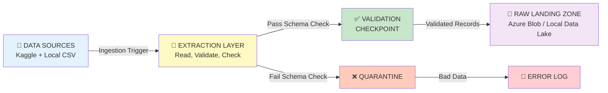
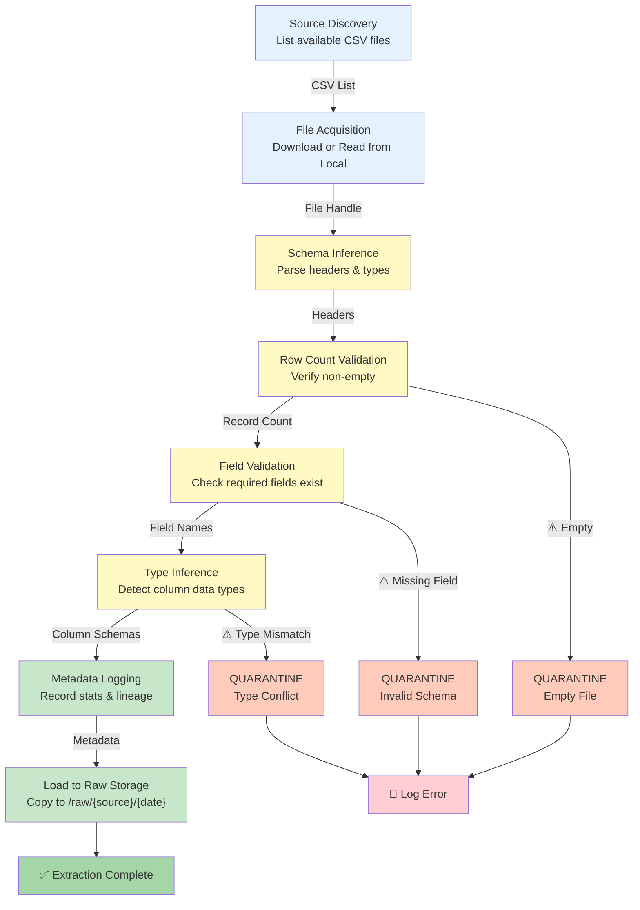
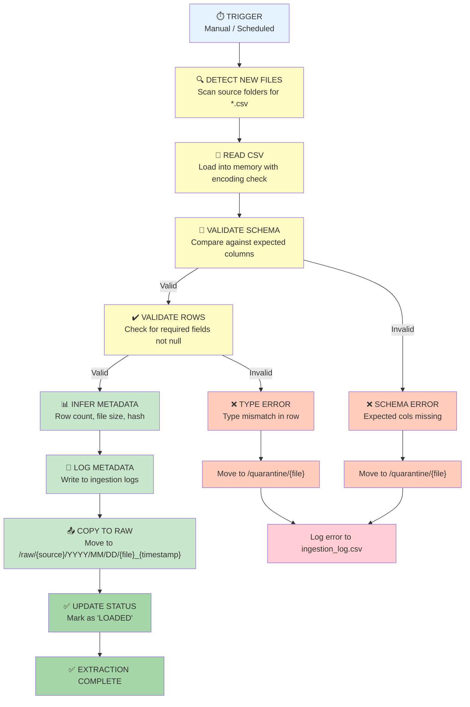
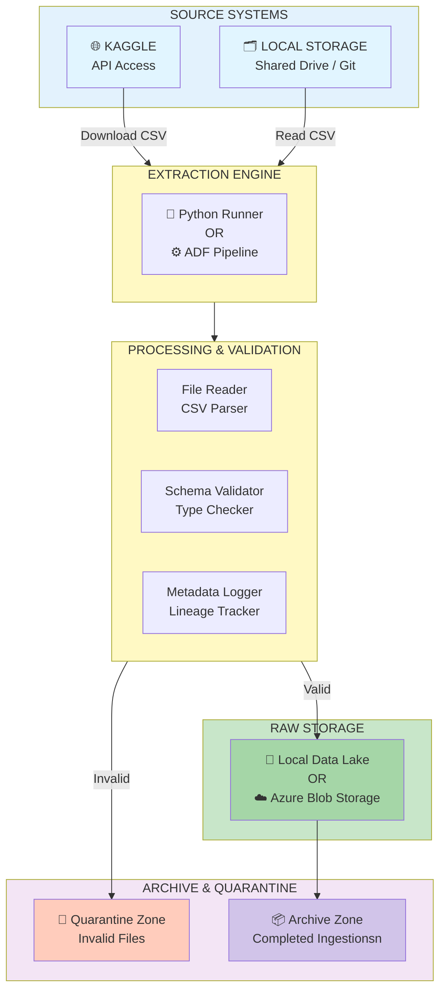
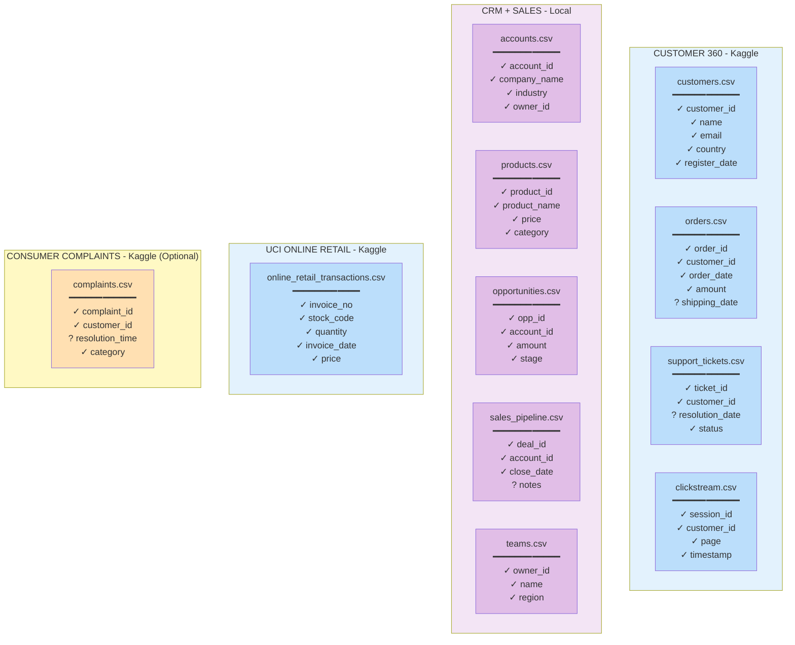
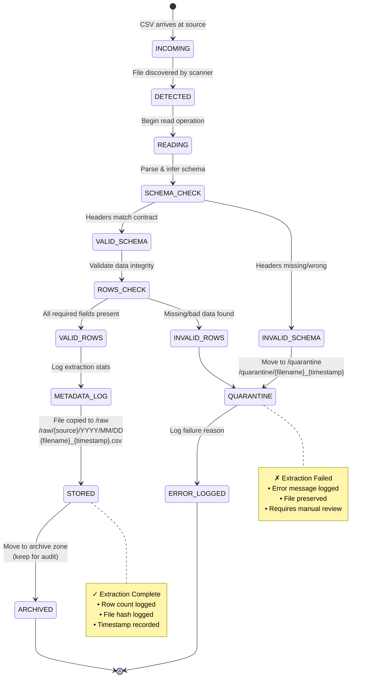
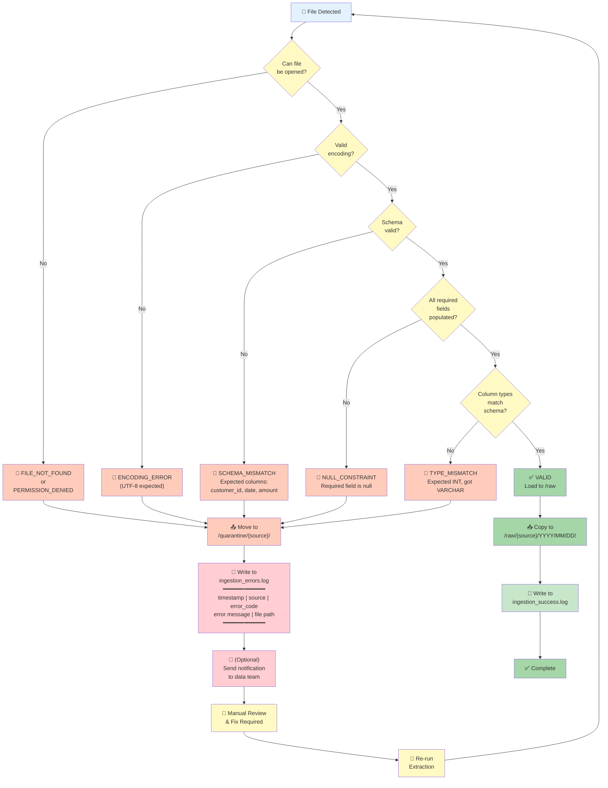
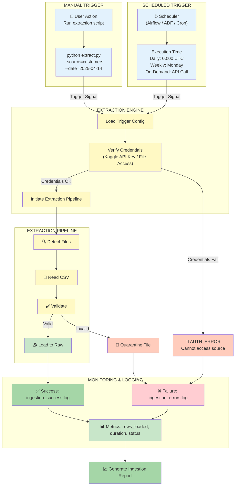

# Phase 1: Source Identification & Extraction Diagrams

---

## 1. SOURCE LANDSCAPE DIAGRAM

```mermaid
graph TB
    subgraph Kaggle["KAGGLE DATASETS"]
        K1["📊 Customer 360<br/>customers.csv<br/>orders.csv<br/>support_tickets.csv<br/>clickstream.csv<br/><br/>PRIMARY | Auto Download"]
        K2["📊 UCI Online Retail II<br/>online_retail_transactions.csv<br/><br/>PRIMARY | Auto Download"]
        K3["📊 Consumer Complaints<br/>complaints.csv<br/><br/>OPTIONAL | Auto Download"]
    end
    
    subgraph Local["LOCAL / SHARED STORAGE"]
        L1["🗂️ CRM + Sales Systems<br/>accounts.csv<br/>products.csv<br/>opportunities.csv<br/>sales_pipeline.csv<br/>teams.csv<br/><br/>PRIMARY | File Share / Git"]
    end
    
    subgraph Ownership["OWNERSHIP & ACCESS"]
        O1["Kaggle API Key<br/>Authenticated Downloads"]
        O2["Shared Drive<br/>Local Repository"]
    end
    
    K1 -.→ O1
    K2 -.→ O1
    K3 -.→ O1
    L1 -.→ O2
    
    style K1 fill:#e1f5ff
    style K2 fill:#e1f5ff
    style K3 fill:#fff9c4
    style L1 fill:#f3e5f5
```

---

## 2. DATA FLOW DIAGRAM (LEVEL 0 - HIGH LEVEL)



---

## 3. DATA FLOW DIAGRAM (LEVEL 1 - DETAILED STEPS)



---

## 4. EXTRACTION PIPELINE DIAGRAM



---

## 5. SYSTEM ARCHITECTURE DIAGRAM



---

## 6. DATA CONTRACT / SCHEMA BOUNDARY DIAGRAM



Legend:
- **✓** = Required (non-nullable)
- **?** = Optional (nullable)

---

## 7. FILE LIFECYCLE DIAGRAM



---

## 8. ERROR HANDLING FLOW DIAGRAM



---

## 9. INGESTION TRIGGER DIAGRAM



---

## Key Naming Conventions

```
Raw Storage Path Structure:
/raw/{source_name}/YYYY/MM/DD/

Examples:
/raw/customer_360/2025/04/14/customers_2025-04-14_143022.csv
/raw/customer_360/2025/04/14/orders_2025-04-14_143045.csv
/raw/crmn_sales/2025/04/14/accounts_2025-04-14_130500.csv
/raw/uci_retail/2025/04/14/online_retail_2025-04-14_090000.csv

Quarantine Path:
/quarantine/{source_name}/{filename}_{timestamp}_{error_code}.csv

Example:
/quarantine/customer_360/support_tickets_2025-04-14_143200_SCHEMA_MISMATCH.csv

Metadata Files:
ingestion_success.log
ingestion_errors.log
ingestion_stats_{YYYYMMDD}.json
```

---

## Metadata Fields to Log Per Extraction

```
source_name: string                    (customer_360, crmn_sales, etc.)
file_name: string                      (customers.csv)
extracted_timestamp: datetime          (2025-04-14 14:30:22)
extract_duration_seconds: integer      (2)
row_count: integer                     (50000)
file_size_bytes: integer               (2500000)
file_hash_md5: string                  (a1b2c3d4e5f6...)
schema_status: enum                    (VALID, INVALID, INFERRED)
row_validation_status: enum            (PASSED, FAILED, WARNINGS)
extraction_status: enum                (SUCCESS, QUARANTINED, ERROR)
error_code: string                     (NULL or SCHEMA_MISMATCH, TYPE_ERROR, etc.)
error_message: string                  (NULL or detailed error)
extracted_path: string                 (/raw/customer_360/2025/04/14/...)
quarantine_path: string                (NULL or /quarantine/...)
```

---

**END OF PHASE 1 EXTRACTION DIAGRAMS**
