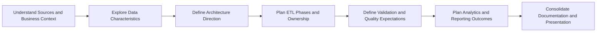
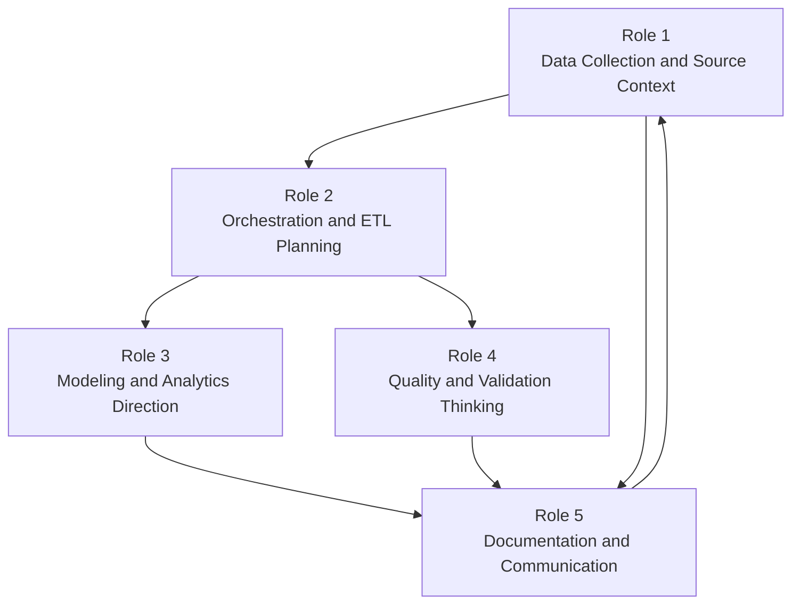
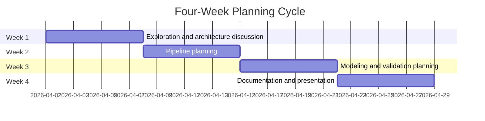

# Project Overview

ETL for Customer Data from Multiple Sources is a team planning project focused on creating a shared understanding of how customer information should move from fragmented source systems into a trusted analytical view. The project is valuable because customer records often exist in separate tools, use different formats, and carry inconsistent business meaning. Without a coordinated plan, teams can produce outputs that look complete but are difficult to trust or explain.

The purpose of this guide is to help the team align on thinking before implementation. It clarifies what needs to be discussed, what each role needs to understand, and which decisions must be made together. The goal is not to finalize technical details at this stage, but to build a strong planning foundation for work across Azure Data Factory, Azure Blob Storage, Azure SQL or SQL Server, and Power BI.

# Project Flow

The project should progress as a sequence of planning conversations and shared decisions. Each stage builds context for the next stage, so the team can avoid jumping into implementation before core questions are answered.

Conceptual progression:

- Understand source context and business goals.
- Explore available data and identify uncertainty.
- Define architecture direction at a high level.
- Plan pipeline phases and role boundaries.
- Define data quality expectations and review approach.
- Plan analytics outcomes and reporting intent.
- Consolidate documentation and presentation narrative.

This flow is conceptual and is intended to support team discussion, not to represent a final technical design.

# Architecture Thinking

A useful way to frame architecture thinking is the generic ETL pattern:

Sources -> Raw Data -> Transformation -> Curated Data -> Analytics

Each stage should be discussed in terms of purpose:

- Sources: where customer data originates and what business process created it.
- Raw Data: where original data is preserved for traceability and future review.
- Transformation: where business rules and consistency decisions are defined conceptually.
- Curated Data: where the team describes what trusted, analysis-ready data should represent.
- Analytics: where reporting and insight consumption are planned for business users.

The team should use this model to ask architectural questions and compare options. It should not be treated as a finalized blueprint.

# Required Knowledge & Prerequisites

## Role 1 — Data Collection & Cloud Storage (Extraction)

Owner: Amin,Ali

Topics this role should understand:

- source system discovery and data ownership
- file-based data exchange patterns
- data profiling basics
- raw data preservation principles
- data handoff expectations to downstream roles
- file organization concepts for shared team workflows

Questions this role should help answer:

- What data sources exist for customer information?
- How are source files received and how often?
- How reliable are source deliveries over time?
- What source-level risks could affect planning?
- What context should be documented when files arrive?

### Deliverables

- List of data sources (APIs, CSV, JSON)
- Sample raw datasets stored in `/data/raw`
- Python extraction scripts (API calls, file ingestion)
- Source schema preview (columns per dataset)
- Data ingestion logs or tracking

## Role 2 — Data Cleaning & Orchestration (ETL)

Owner: Ali

Topics this role should understand:

- orchestration concepts and dependency planning
- transformation planning boundaries
- schema consistency thinking across multiple sources
- sequencing of conceptual ETL stages
- handling uncertainty in early design assumptions
- communication of open technical questions to the team

Questions this role should help answer:

- What ETL phases should be defined before implementation?
- Which design decisions require cross-role agreement?
- Where are the largest unknowns in source consistency?
- What should be treated as design assumptions versus confirmed facts?
- How should planning decisions be documented for traceability?

### Deliverables

- Python transformation scripts
- Unified schema across all sources
- Data cleaning logic (null handling, type fixing, deduplication)
- Main ETL pipeline script (e.g. main.py)
- Pipeline flow definition (ADF pipeline or Airflow DAG)

## Role 3 — Data Modeling, SQL Architecture & Power BI

Owner: Mennatullah, Amin

Topics this role should understand:

- conceptual data modeling principles
- business-oriented data representation
- analytical consumption needs
- alignment between curated data and reporting goals
- lifecycle thinking for evolving customer information
- communication between modeling and analytics planning

Questions this role should help answer:

- What should the curated customer view represent conceptually?
- Which business questions should analytics be able to answer?
- What level of historical context is important for decision-making?
- How should modeling decisions be explained to non-technical stakeholders?
- What assumptions must be validated before finalizing model direction?

### Deliverables

- Database schema design (tables like customers, leads, etc.)
- SQL scripts in `/sql/scripts`
- Table creation scripts (DDL)
- Sample queries for validation
- (Optional) basic Power BI dataset connection

## Role 4 — Data Quality & Automated Testing

Owner: Aseel,Habiba

Topics this role should understand:

- data quality dimensions and terminology
- conceptual validation planning
- issue classification and severity thinking
- trust criteria for curated outputs
- rejected or questionable data handling concepts
- communication of quality risks to the team

Questions this role should help answer:

- Which data quality concerns are most critical to business trust?
- How should the team define acceptable versus unacceptable data quality?
- What quality evidence should exist before outputs are considered reliable?
- How should quality findings influence architecture and pipeline planning?
- Which open quality questions must be resolved before implementation?

### Deliverables

- Data validation rules (email format, required fields, uniqueness)
- Data quality scripts/checks
- Logic for:
  - `/data/clean`
  - `/data/rejected`
  - `/data/quarantine`
- Data quality report (counts of valid/invalid records)

## Role 5 — Documentation

Owner: Ali, Amin, Mennat Allah, Aseel, Habiba

Topics this role should understand:

- documentation structure and audience awareness
- data lineage storytelling
- architecture communication for mixed technical levels
- change tracking in collaborative projects
- clarity and consistency in shared project language
- presentation framing for project progress and outcomes

Questions this role should help answer:

- Are planning decisions captured clearly and consistently?
- Can a new teammate understand the project from current documents?
- Which concepts remain unclear and need better explanation?
- How should progress be communicated each week?
- Does documentation reflect shared team understanding or isolated opinions?

### Deliverables

- Updated README.md (simplified workflow)
- Detailed documentation in `/docs`
- Wiki pages for concepts and onboarding
- Architecture diagrams
- Weekly progress updates
- Final presentation materials

# Data Exploration

Data exploration should be treated as a discovery phase where the team studies CRM and Excel datasets to understand structure, consistency, and risk before making design commitments. The objective is to identify what is known, what is uncertain, and what must be clarified with stakeholders.

Key questions for exploration:

- What kinds of fields appear in each source?
- How consistent is the information between sources?
- What might represent customer identity across systems?
- Where could duplicate records appear?
- Which values are often missing or ambiguous?
- What differences might affect later integration decisions?
- Which observations are confirmed versus tentative?

The exploration output should be a shared discussion record with open questions and assumptions, not a finalized transformation or modeling design.

# Repository Structure

The repository should be used as a planning framework that keeps team discussions organized and easy to follow.

| Folder | Conceptual purpose |
|---|---|
| `data/raw` | Represents original input context and source reference material. |
| `data/clean` | Represents the intended destination for curated outcomes. |
| `adf/pipelines` | Represents orchestration planning artifacts and flow narratives. |
| `adf/datasets` | Represents dataset perspective and source-target understanding. |
| `adf/linked_services` | Represents connection context and integration boundaries. |
| `sql/scripts` | Represents database-side planning discussions and architecture notes. |
| `docs` | Represents structured project guidance and shared planning decisions. |
| `wiki` | Represents extended knowledge, glossary terms, and team onboarding context. |

The structure should help the team separate conceptual thinking areas while maintaining one coherent project story.

# Team Collaboration Flow

Team collaboration should be continuous and iterative. Roles should not operate in isolation, because design questions in one area often affect decisions in another.

This collaboration flow highlights feedback loops between planning areas and reinforces shared ownership of project understanding.

# Project Timeline

The project can be organized into a four-week planning cycle. The weekly focus is conceptual and discussion-driven.

- Week 1: exploration and architecture discussion
- Week 2: pipeline planning
- Week 3: modeling and validation planning
- Week 4: documentation and presentation

The timeline should be used to support alignment and learning. If new information appears, the team can refine planning discussions while keeping the same overall flow.

# Deliverables

Expected deliverables are conceptual planning artifacts that help the team move into implementation with confidence.

- architecture diagrams
- ETL planning documentation
- data exploration summary and open-question log
- validation rule documentation
- conceptual schema design discussion
- reporting ideas and dashboard concepts
- role collaboration notes
- weekly progress summaries
- final presentation

These deliverables should capture team thinking and decision rationale, not implementation details.

# Success Criteria

Project planning can be considered complete when the team has a shared and documented understanding of the problem, the project flow, role responsibilities, and key design questions.

Indicators of planning completion:

- the team agrees on project purpose and expected outcomes
- the conceptual ETL flow is documented and understood by all roles
- source exploration findings and uncertainties are clearly recorded
- each role can explain its knowledge prerequisites and core questions
- collaboration flow and weekly planning cadence are visible and practical
- conceptual deliverables are complete and presentation-ready
- documentation enables a new teammate to understand the project direction quickly

When these criteria are met, the team is well-positioned to begin implementation with fewer assumptions and stronger cross-role alignment.
